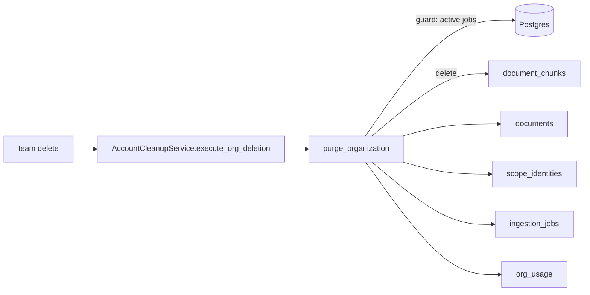

# Backend and Database Manual

## Overview
The backend is a FastAPI service in `backend/` with a Supabase/Postgres persistence layer. The system is organization-aware and enforces scope isolation through composite keys, RLS policies, and org-scoped RPCs.

Key subsystems:
- API routers: `backend/api/v1/`
- Team and plan resolution: `backend/services/team_service.py`
- Scope identities: `backend/services/scope_identity.py`
- Scope-aware chat: `backend/api/v1/chat.py`
- Cleanup and purge: `backend/services/cleanup.py`
- Supabase migrations: `supabase/migrations/`

## API Structure (High Level)
Routers and responsibilities:
- Chat and conversations: `backend/api/v1/chat.py`
- Search (hybrid + scoped): `backend/api/v1/search.py`
- Documents and ingestion jobs: `backend/api/v1/documents.py`, `backend/api/v1/jobs.py`
- Integrations/connectors: `backend/api/v1/integrations.py`
- Team and billing: `backend/api/v1/team.py`, `backend/api/v1/billing.py`
- Usage/quota: `backend/api/v1/usage.py`
- Notifications and settings: `backend/api/v1/notifications.py`, `backend/api/v1/settings.py`
- Health and admin: `backend/api/v1/health.py`, `backend/api/v1/admin.py`

## Composite Key Security and Organizational Isolation
Current composite key model:
- `scope_identities` primary key is `(organization_id, id)`.
- `documents` uses a composite FK `(organization_id, scope_id)` referencing `scope_identities(organization_id, id)`.

Source of truth:
- Migration: `supabase/migrations/20260118000000_add_organization_id_scopes.sql`
- Earlier user-level composite key migration: `supabase/migrations/20260117000000_scope_identities_composite_key.sql` (superseded by org-level PK).

In the API layer:
- Organization is resolved per request using `team_service.get_organization_id()` in `backend/services/team_service.py`.
- Chat and retrieval always pass `organization_id` to scoped RPCs and identity fetch in `backend/api/v1/chat.py`.

## RLS Policies (Supabase)
Scope identities:
- Org-aware RLS policies defined in `supabase/migrations/20260118000000_add_organization_id_scopes.sql`:
  - SELECT/INSERT/UPDATE/DELETE allowed when `organization_id` is in the caller's `team_members` or `user_id = auth.uid()`.

Documents and chunks:
- Read-only policies for documents and document_chunks, with team membership helper functions, defined in `supabase/migrations/20260108125000_fix_rls_team_recursion.sql`.
- Policies allow access when the user owns the document or is a team member of the owner.

## Database Schema (Scopes and Identities)
Key tables:
- `scope_identities`
  - Columns: `organization_id` (UUID, not null), `id` (text), `user_id`, `type`, `summary`, `file_tree`, `attributes` (jsonb), `last_ingested_at`, timestamps.
  - PK: `(organization_id, id)`.
- `documents`
  - Columns: `id` (UUID), `organization_id`, `user_id`, `team_id`, `scope_id`, `source_type`, `source_id`, `metadata`, `file_size_bytes`, timestamps.
  - FK: `(organization_id, scope_id)` -> `scope_identities`.
- `document_chunks`
  - Columns: `document_id`, `content`, `embedding` (vector), `chunk_index`, timestamps.
- `org_usage`
  - Columns: `org_id`, `llm_tokens_used`, timestamps.
- `teams`
  - Columns: `id`, `owner_id`, `llm_token_balance`, timestamps.

Schema sources:
- `supabase/migrations/20260116000004_scope_identities.sql`
- `supabase/migrations/20260117000000_scope_identities_composite_key.sql`
- `supabase/migrations/20260118000000_add_organization_id_scopes.sql`
- `supabase/migrations/20260201000000_llm_quota_and_identity_lock.sql`

## Org-Scoped RPCs
Search functions are org-aware:
- `hybrid_search`, `hybrid_search_scoped`, `match_documents` filter by `organization_id`.
- Defined in `supabase/migrations/20260118000001_hybrid_search_org_scoped.sql`.

Identity write locking:
- `upsert_scope_identity_document` (SELECT FOR UPDATE) prevents concurrent identity writes.
- Defined in `supabase/migrations/20260201000000_llm_quota_and_identity_lock.sql`.

## Transactional Purge (Org Deletion)
Org deletion is transactional and guarded:
- RPC `purge_organization` checks for active ingestion jobs and aborts if any are `pending` or `processing`.
- Deletes chunks, documents, scope identities, ingestion jobs, and org_usage in a single function.
- Invoked by `AccountCleanupService.execute_org_deletion()` in `backend/services/cleanup.py`.

Mermaid: org purge path

## Notes for Operations
- Scope identity fetches must include `organization_id` to avoid cross-org data leaks.
- Supabase service role bypasses RLS; API and worker code still enforce org filters explicitly (example: `backend/api/v1/chat.py`).

## API Reference
- See `Production_Docs/API_REFERENCE.md` for endpoint-by-endpoint details.
