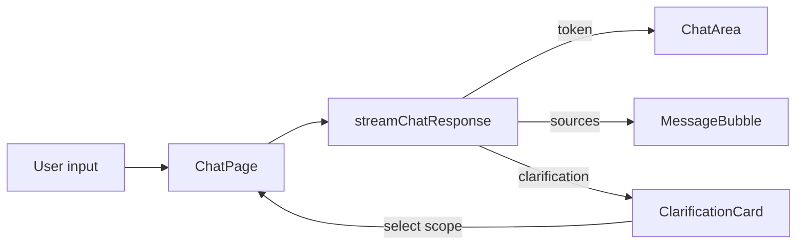

# Frontend Architecture Guide

## Overview
The frontend is a Next.js app in `frontend-new/` using React Server Components with client-side islands for interactive flows. The chat UX is a streaming RAG client with scope-aware clarification handling and Supabase-authenticated API calls.

Primary entry points and providers:
- App routing: `frontend-new/app/` (chat uses `frontend-new/app/dashboard/chat/[chatId]/page.tsx`)
- API client + auth token cache: `frontend-new/lib/api.ts`
- Chat API helpers and SSE parsing: `frontend-new/lib/chat-utils.ts`
- React Query setup + global error toasts: `frontend-new/components/providers/QueryProvider.tsx`
- Chat history context: `frontend-new/hooks/useChatHistory.tsx`
- Toast system (local): `frontend-new/hooks/use-toast.ts`

## Component Hierarchy (Chat)
Chat page stack (core path):
- `frontend-new/app/dashboard/chat/[chatId]/page.tsx`
  - `ChatArea` (`frontend-new/components/chat/ChatArea.tsx`)
    - `MessageBubble` (`frontend-new/components/chat/MessageBubble.tsx`)
      - `SourcePillList` / `SourceCard` for citations
    - `ClarificationCard` (`frontend-new/components/chat/ClarificationCard.tsx`) for HTTP 300
    - `ChatInput` (`frontend-new/components/chat/ChatInput.tsx`)
    - `EmptyState` (`frontend-new/components/chat/EmptyState.tsx`)

## State Management
The frontend uses a layered state model:
- React Query (server state): `QueryProvider` configures caching, retries, and global error toasts via Sonner.
- Context (chat history): `ChatHistoryProvider` in `frontend-new/hooks/useChatHistory.tsx` exposes conversation CRUD and message load helpers.
- Local React state (chat UI): `frontend-new/app/dashboard/chat/[chatId]/page.tsx` owns message list, streaming buffer, typing state, and scope selection.
- Zustand (local UI state): `frontend-new/store/useHelpStore.ts` stores Help Center modal state.

## Context-Aware UI Logic
The chat UI is designed to interpret scope signals emitted by the backend:
- SSE events parsed in `frontend-new/lib/chat-utils.ts` emit `token`, `sources`, `scope_context`, `clarification`, and `done`.
- `ChatPage` stores `scope_context` on the assistant message and tracks a sticky scope via `currentScopeId` to reuse context on follow-up requests.
- `ClarificationCard` presents multiple scopes when the backend returns HTTP 300 (Multiple Choices).

Mermaid trace (streamed chat with clarification):

## Clarification Card (HTTP 300) Handling
Clarification is a first-class response type:
- Backend returns 300 with a `ClarificationResponse` payload.
- `streamChatResponse` yields `type: clarification` even in streaming mode.
- `ChatPage` appends a `role: clarification` message with candidates and original query.
- `ChatArea` intercepts clarification messages and renders `ClarificationCard`.
- Selecting a candidate replays the original query with a `scope_id`.

Key files:
- `frontend-new/lib/chat-utils.ts` (300 handling)
- `frontend-new/app/dashboard/chat/[chatId]/page.tsx` (clarification state + resend)
- `frontend-new/components/chat/ClarificationCard.tsx` (candidate list)

## Search All (__all__) Wiring
Search-all is treated as a special scope selection:
- `ClarificationCard` includes a "search all sources" action that emits `__all__`.
- `ChatPage` normalizes `__all__` and sends it as `scope_id` in the chat request.
- Sticky scope resets to `null` when `__all__` is selected.

Key files:
- `frontend-new/components/chat/ClarificationCard.tsx`
- `frontend-new/app/dashboard/chat/[chatId]/page.tsx`

## Error Mapping and Toast Strategy
Two layers of error handling exist:
- Per-chat errors: `getChatErrorDisplay()` maps backend error codes (`LLM_TIMEOUT`, `PLAN_LIMIT_EXCEEDED`, `INTEGRATION_AUTH_FAILED`, `CONNECTOR_UNAVAILABLE`) to human-friendly toast messages in `frontend-new/app/dashboard/chat/[chatId]/page.tsx`.
- Global API errors: `QueryProvider` handles HTTP 500s globally via Sonner toast notifications.

## Auth and API Calls
- Supabase session tokens are fetched per request in `frontend-new/lib/chat-utils.ts`.
- Axios client in `frontend-new/lib/api.ts` caches JWT tokens and refreshes them close to expiry.
- Unauthorized responses (401) invalidate the cached token for a forced refresh on next request.

## Notes for Extension
- `ScopeBadge` exists as a UI component in `frontend-new/components/chat/ScopeBadge.tsx` for rendering scope context, but it is not currently wired into `ChatArea` or `MessageBubble`.
