# Connector and Unified Ingestion Protocol

## Overview
The ingestion pipeline enforces a strict SourceDocument contract and a scope-aware chain of custody. Each connector must stamp a canonical `scope_id` at source, and the worker refuses documents without it.

Key contracts and entry points:
- SourceDocument schema: `backend/connectors/enhanced.py`
- Scope URI builder: `backend/core/scopes.py`
- Unified ingestion orchestration: `backend/worker/tasks.py`
- Connector registry: `backend/connectors/registry.py`

## Canonical Scope IDs
`backend/core/scopes.py` defines canonical formats:
- GitHub: `github://{org}/{repo}@{branch}`
- S3: `s3://{bucket}/{prefix}`
- Box: `box://folder/{folder_id}:{folder_name}`
- Dropbox: `dropbox://{namespace_id}/{path}`
- Google Drive: `gdrive://{drive_id}/{folder_id}:{name}`
- Notion: `notion://{workspace_id}/{page_id}:{title}`
- Web: `web://{domain}`
- File upload: `file_upload://{storage_path}`

## Connector Implementations (Scope Stamping)
Current scope-aware connectors that explicitly call `build_scope_uri`:
- GitHub: `backend/connectors/github.py` in `_fetch_single_file` and folder expansion.
- S3: `backend/connectors/s3.py` in `fetch_documents_sync`.
- Box: `backend/connectors/box.py` in `_build_source_document`.

Other connectors (Drive, Notion, Dropbox, OneDrive, SharePoint, SFTP, Web, File Upload) currently emit metadata without an explicit `scope_id`. The worker enforces `scope_id` and will fail fast if missing, so these connectors must be updated to comply before production use.

Connector registry:
- `backend/connectors/registry.py` lists supported connectors and capabilities.

## Unified Ingestion Pipeline (Worker)
The ingestion flow is driven by Celery tasks in `backend/worker/tasks.py`:
1. `unified_ingest_task` resolves connector and fetches `SourceDocument` items.
2. Each document becomes an `ingestion_file_status` row and is serialized for Celery.
3. `process_file_task` decodes content, enforces `scope_id` and `organization_id`, then parses content with `DocumentProcessorFactory` in `backend/services/parsers.py`.
4. Parsed chunks are embedded via `backend/services/embeddings.py` and stored in `documents` and `document_chunks`.
5. `finalize_job_task` groups documents by scope and triggers identity synthesis.

Worker enforcement points:
- `process_file_task` in `backend/worker/tasks.py` raises if `scope_id` or `organization_id` is missing.
- `unified_ingest_task` sets `scope_id` in task payload and expects connectors to provide it.

Mermaid: ingestion to vector flow
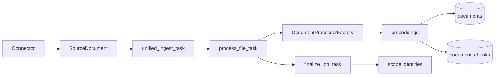

## Identity Synthesis (Finalize Job)
Identity synthesis runs after job completion:
- `finalize_job_task` gathers successfully indexed documents and groups by `scope_id`.
- `synthesize_and_save_identity` builds a summary and tree and persists to `scope_identities`.
- Database-level locking is handled by RPC `upsert_scope_identity_document` (SELECT FOR UPDATE) defined in `supabase/migrations/20260201000000_llm_quota_and_identity_lock.sql`.

Identity safeguards in `backend/services/scope_identity.py`:
- `MAX_DOCS_FOR_IDENTITY = 1000` (sampling for large scopes)
- `MAX_TREE_DEPTH = 3` (tree depth cap)
- `MAX_SUMMARY_CHARS = 2000` (summary size cap)
- Mandatory `scope_id`, `organization_id`, and `user_id` arguments (missing values raise ValueError)

## Connector Summary (Current Code)
Connector list (see `backend/connectors/`):
- GitHub, S3, Box (scope stamping implemented)
- Google Drive, Notion, Dropbox, OneDrive, SharePoint, SFTP, Web, File Upload (scope stamping pending)

## Connector Flows (Sequence Diagrams)
Each diagram includes connection, discovery/listing, ingestion, and identity synthesis stages.

### File Upload
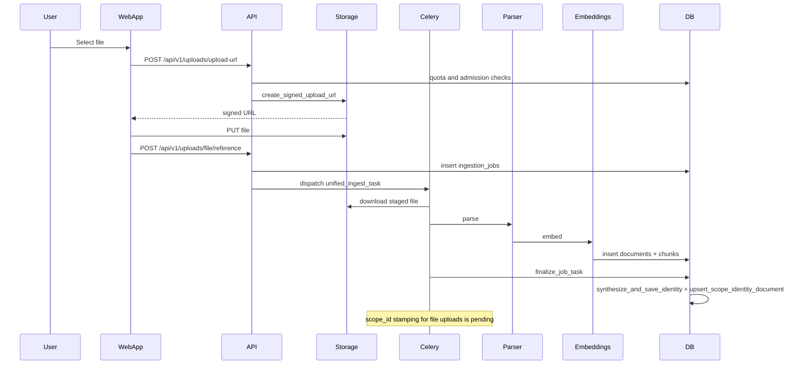

### GitHub
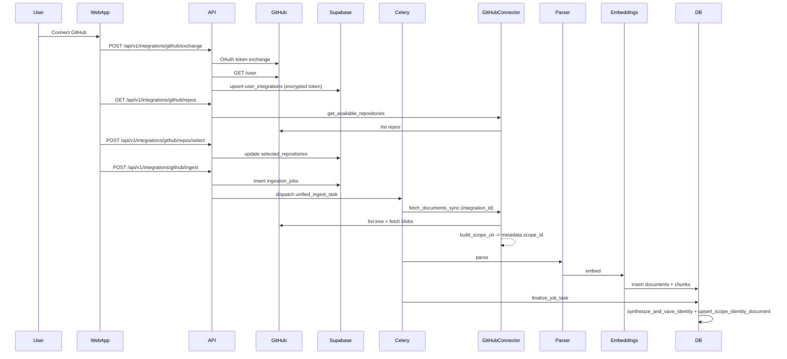

### Box
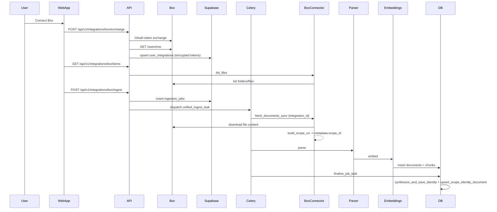

### Google Drive
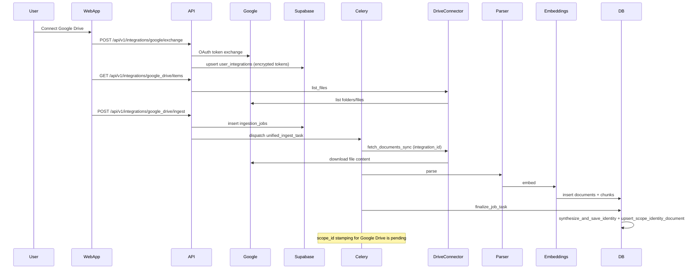

### Notion
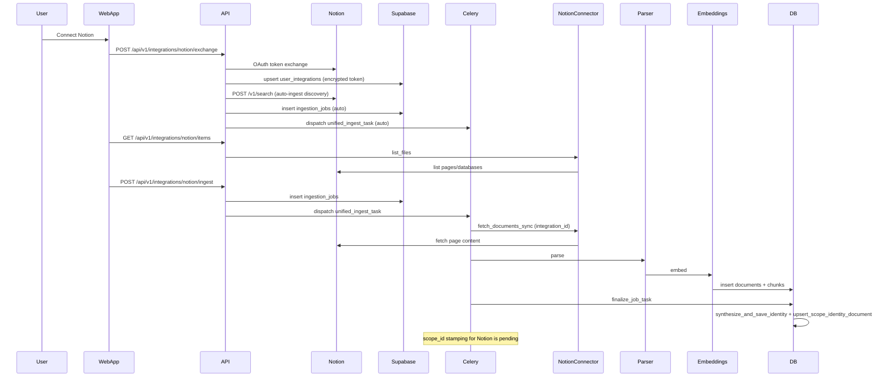

### Dropbox
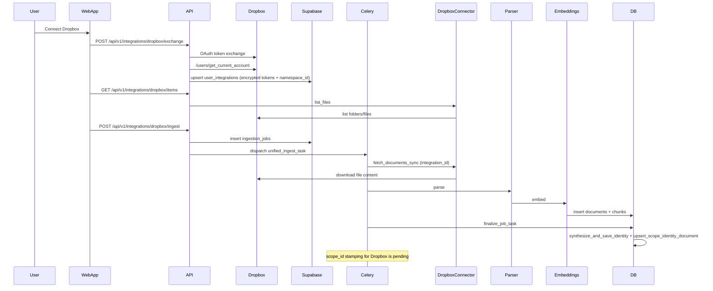

### OneDrive
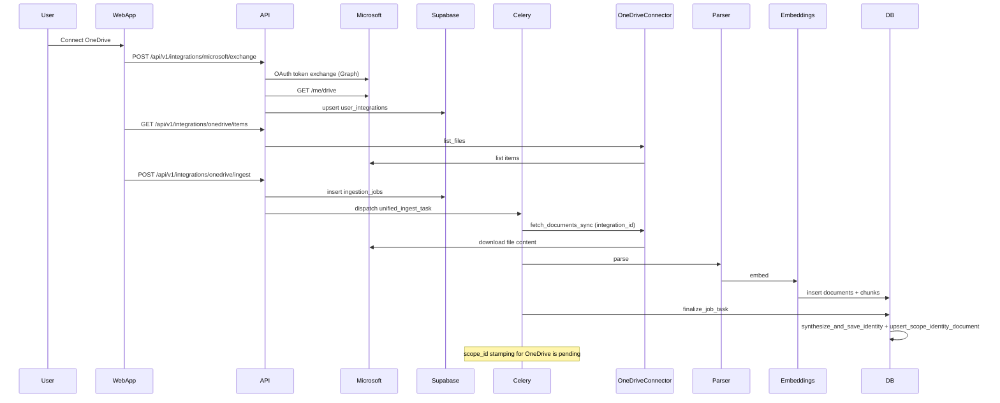

### SharePoint
```mermaid
sequenceDiagram
  participant U as User
  participant W as WebApp
  participant A as API
  participant M as Microsoft
  participant S as Supabase
  participant Q as Celery
  participant C as SharePointConnector
  participant P as Parser
  participant E as Embeddings
  participant D as DB
  U->>W: Connect SharePoint
  W->>A: POST /api/v1/integrations/microsoft/exchange
  A->>M: OAuth token exchange (Graph)
  A->>M: GET /sites/root or /sites/{site_id}
  A->>S: upsert user_integrations
  W->>A: GET /api/v1/integrations/sharepoint/items
  A->>C: list_files
  C->>M: list items
  W->>A: POST /api/v1/integrations/sharepoint/ingest
  A->>S: insert ingestion_jobs
  A->>Q: dispatch unified_ingest_task
  Q->>C: fetch_documents_sync (integration_id)
  C->>M: download file content
  Q->>P: parse
  P->>E: embed
  E->>D: insert documents + chunks
  Q->>D: finalize_job_task
  D->>D: synthesize_and_save_identity + upsert_scope_identity_document
  Note over Q: scope_id stamping for SharePoint is pending
```

### SFTP
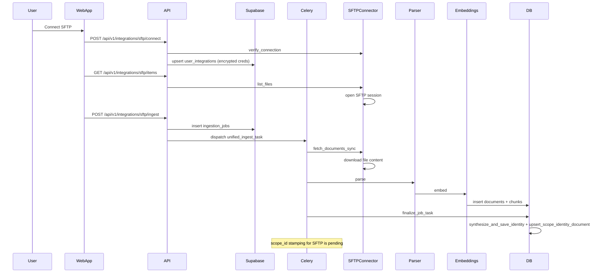

### S3
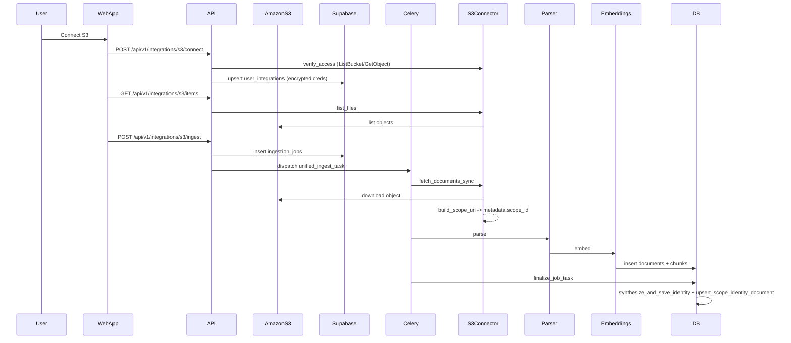

### Web
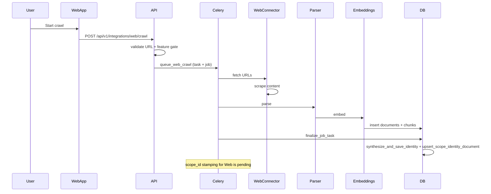

## Recommendations for New Connectors
- Always call `build_scope_uri` with connector-specific metadata.
- Write `scope_id` into `SourceDocument.metadata` at creation time.
