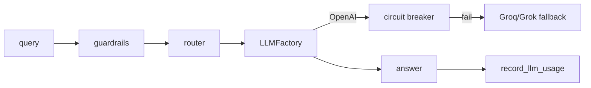

# Chat, LLM Orchestration, and Failover

## Overview
The LLM layer is designed for reliability, cost control, and scope-aware context injection. The orchestration pipeline is primarily implemented in `backend/api/v1/chat.py` and backed by `LLMFactory`, `LLMRouter`, and usage tracking services.

Key files:
- Orchestration: `backend/api/v1/chat.py`
- Model factory: `backend/services/llm_factory.py`
- Routing: `backend/services/router.py`
- Guardrails: `backend/services/guardrails.py`
- Quota enforcement: `backend/services/usage.py`
- Circuit breaker: `backend/core/resilience.py`

## Provider Support
Configured providers (all OpenAI-compatible chat interfaces):
- OpenAI: `gpt-4o`, `gpt-4o-mini`
- Groq: `llama-3.1-8b-instant` (guardrails), `llama-3.3-70b-versatile` (fallback)
- Grok (xAI): optional fallback provider via `GROK_API_KEY`

Instantiation is centralized in `backend/services/llm_factory.py`.

## Routing and Plan Enforcement
Routing logic is handled by `LLMRouter` and `LLMFactory`:
- `LLMRouter.select_model()` chooses fast vs smart based on plan tier and guardrail complexity.
- `ComplexityEvaluator` forces the smart tier when keywords such as `refactor`, `architect`, or `optimize` appear in the prompt.
- `LLMFactory.get_model()` enforces plan constraints and viewer-role downgrades.

## Failover and Circuit Breaker
Failover is implemented in `backend/api/v1/chat.py`:
- Primary provider is selected by plan and routing logic.
- If the primary is OpenAI, `openai_breaker` is checked before use.
- On retryable errors (429 or 5xx), the call falls back to Grok and/or Groq via `llm_router.get_fallback_models()`.
- `LLM_LOAD_BALANCE` (config) rotates fallback ordering.

Circuit breaker details:
- `backend/core/resilience.py` defines `CircuitBreaker` and `openai_breaker`.
- OpenAI breaker opens after 5 consecutive failures and recovers after 60 seconds.

## Prompting and Scope Injection
Prompts are constructed dynamically in `backend/api/v1/chat.py`:
- `SYSTEM_PROMPT` for unscoped queries.
- `SCOPED_SYSTEM_PROMPT` when a dominant/explicit scope is selected.
- `MULTI_SCOPE_SYSTEM_PROMPT` when searching all sources.
- Grok variants (`GROK_*_PROMPT`) reduce verbosity for xAI models.

Scope identity data comes from `scope_identities` and is formatted by `build_scope_identity_context()`.

## Token Budgeting and Quotas
Two layers protect token budgets:
- Scope identity budget: `_apply_scope_identity_budget()` caps identity injection to 70 percent of the model context window.
- Multi-scope identity budget: `GLOBAL_IDENTITY_TOKEN_BUDGET` (2000 tokens) limits summary total for search-all.

Quota enforcement:
- `check_llm_quota()` is called before any LLM invocation.
- `record_llm_usage()` updates `org_usage.llm_tokens_used` and optional `teams.llm_token_balance` overrides.

## Streaming Support
Streaming is supported with SSE in `stream_chat_response()`:
- Sends `token`, `sources`, `scope_context`, and `done` events.
- Uses the same fallback logic as non-streaming calls.
- If partial output has been sent and an error occurs, an `error` event is emitted.

Mermaid: LLM call path

