# AxioHub Architecture Diagrams

> **Version:** 1.0 | **Date:** February 2026 | **Status:** Production
>
> This document contains all Mermaid architecture diagrams for the AxioHub platform.
> Each diagram can be rendered independently for presentations and slide decks.

---

## Table of Contents

1. [System Architecture (High-Level)](#1-system-architecture-high-level)
2. [Request Lifecycle](#2-request-lifecycle)
3. [Authentication Flow](#3-authentication-flow)
4. [OAuth Connector Flow](#4-oauth-connector-flow)
5. [File Upload & Ingestion Pipeline](#5-file-upload--ingestion-pipeline)
6. [Celery Task Chain & Queue Topology](#6-celery-task-chain--queue-topology)
7. [RAG Chat Flow](#7-rag-chat-flow)
8. [Security Layers (Defense in Depth)](#8-security-layers-defense-in-depth)
9. [Ghost Protocol Encryption Flow](#9-ghost-protocol-encryption-flow)
10. [Consent & Compliance Flow](#10-consent--compliance-flow)
11. [Team & RBAC Hierarchy](#11-team--rbac-hierarchy)
12. [Billing & Subscription Flow](#12-billing--subscription-flow)
13. [Frontend Component Architecture](#13-frontend-component-architecture)
14. [Docker Infrastructure](#14-docker-infrastructure)
15. [CI/CD Pipeline Flow](#15-cicd-pipeline-flow)

---

## 1. System Architecture (High-Level)

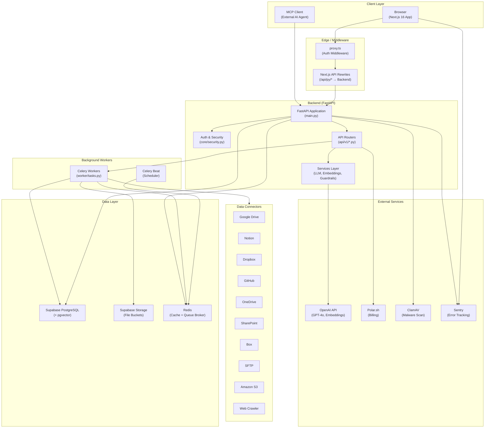

---

## 2. Request Lifecycle

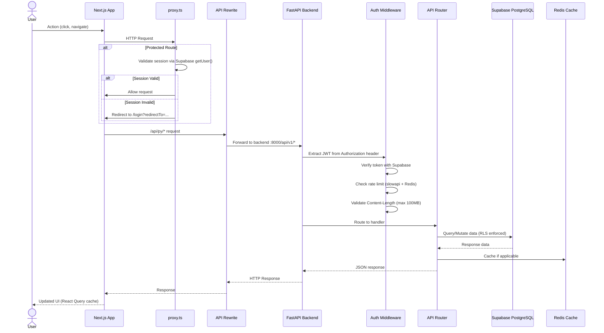

---

## 3. Authentication Flow

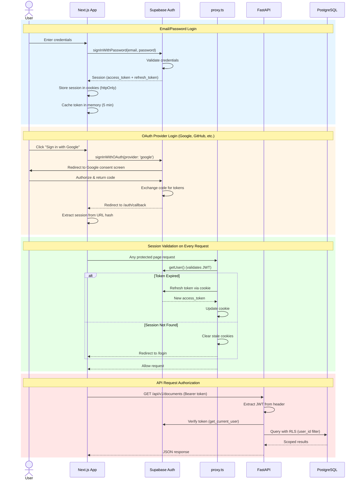

---

## 4. OAuth Connector Flow

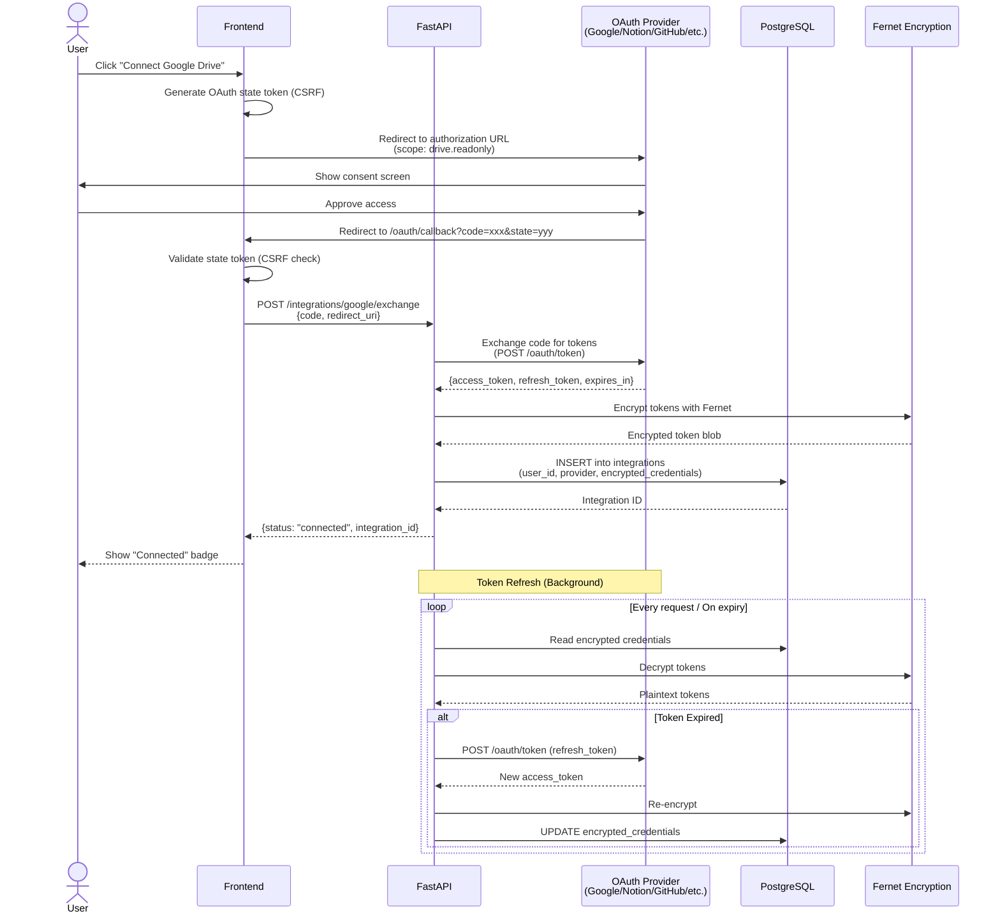

---

## 5. File Upload & Ingestion Pipeline

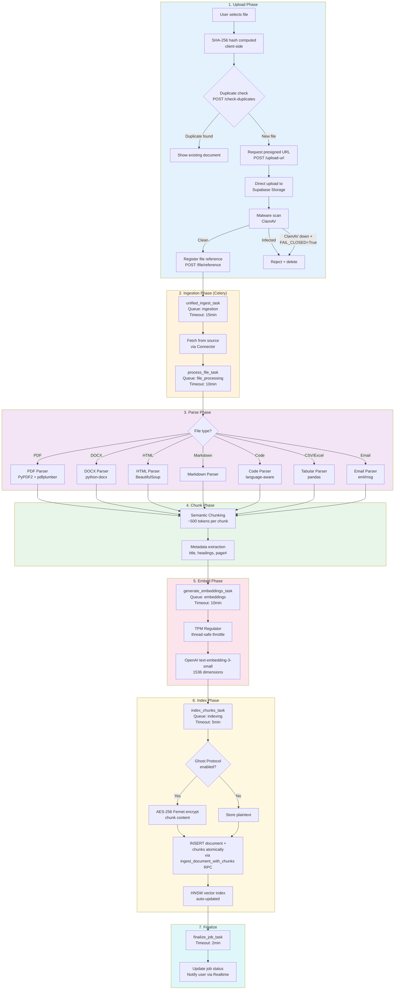

---

## 6. Celery Task Chain & Queue Topology

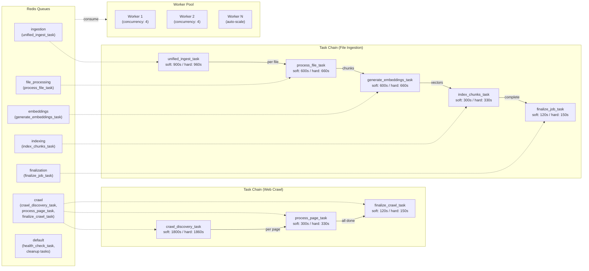

---

## 7. RAG Chat Flow

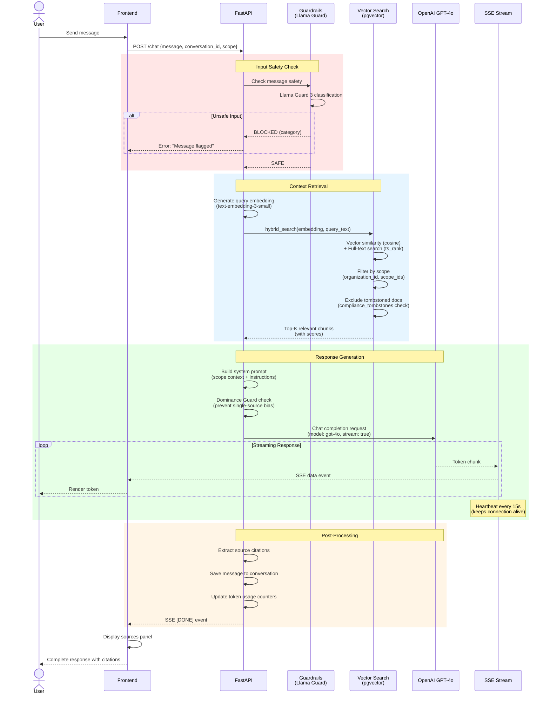

---

## 8. Security Layers (Defense in Depth)

```mermaid
graph TB
    subgraph L1["Layer 1: Network & Transport"]
        HTTPS["HTTPS Only<br/>(HSTS preload)"]
        CORS["CORS Whitelist<br/>(specific origins)"]
        CSP["Content Security Policy<br/>(script-src, connect-src)"]
        XFrame["X-Frame-Options: DENY"]
        NoSniff["X-Content-Type-Options: nosniff"]
    end

    subgraph L2["Layer 2: Authentication"]
        JWT["JWT Verification<br/>(Supabase-issued)"]
        Session["Session Management<br/>(proxy.ts validation)"]
        TokenCache["Token Caching<br/>(5-min in-memory)"]
        OAuthState["OAuth State Tokens<br/>(CSRF protection)"]
    end

    subgraph L3["Layer 3: Authorization"]
        RLS["Row Level Security<br/>(PostgreSQL policies)"]
        RBAC["Role-Based Access<br/>(admin/editor/viewer)"]
        PlanGate["Plan-Based Gates<br/>(require_plan dependency)"]
        ScopeGuard["Scope Guard<br/>(data source isolation)"]
    end

    subgraph L4["Layer 4: Input Validation"]
        RateLimit["Rate Limiting<br/>(slowapi per-endpoint)"]
        BodySize["Request Body Size<br/>(100MB max)"]
        Pydantic["Pydantic Validation<br/>(max_length, Field())"]
        Sanitize["Input Sanitization<br/>(XSS prevention)"]
        OpenRedirect["Open Redirect Prevention<br/>(path validation)"]
    end

    subgraph L5["Layer 5: Data Protection"]
        Fernet["Fernet AES-256<br/>(Ghost Protocol)"]
        TokenEncrypt["OAuth Token Encryption<br/>(at rest)"]
        Wipe["Secure Deletion<br/>(DoD 5220.22-M 3-pass)"]
        Tombstone["Compliance Tombstones<br/>(instant access revocation)"]
    end

    subgraph L6["Layer 6: Runtime Protection"]
        SSRF["SSRF Protection<br/>(getaddrinfo + IP validation)"]
        Malware["Malware Scanning<br/>(ClamAV, fail-closed)"]
        Guardrails["LLM Guardrails<br/>(Llama Guard 3)"]
        ConsoleGate["Console Gating<br/>(no leaks in production)"]
    end

    subgraph L7["Layer 7: Monitoring"]
        SentryFE["Sentry (Frontend)<br/>(client + edge)"]
        SentryBE["Sentry (Backend)<br/>(server)"]
        AuditLog["Audit Logging<br/>(all critical actions)"]
        Health["Health Endpoint<br/>(/health)"]
    end

    L1 --> L2 --> L3 --> L4 --> L5 --> L6 --> L7

    style L1 fill:#e3f2fd
    style L2 fill:#fff3e0
    style L3 fill:#f3e5f5
    style L4 fill:#e8f5e9
    style L5 fill:#fce4ec
    style L6 fill:#fff8e1
    style L7 fill:#e0f7fa
```

---

## 9. Ghost Protocol Encryption Flow

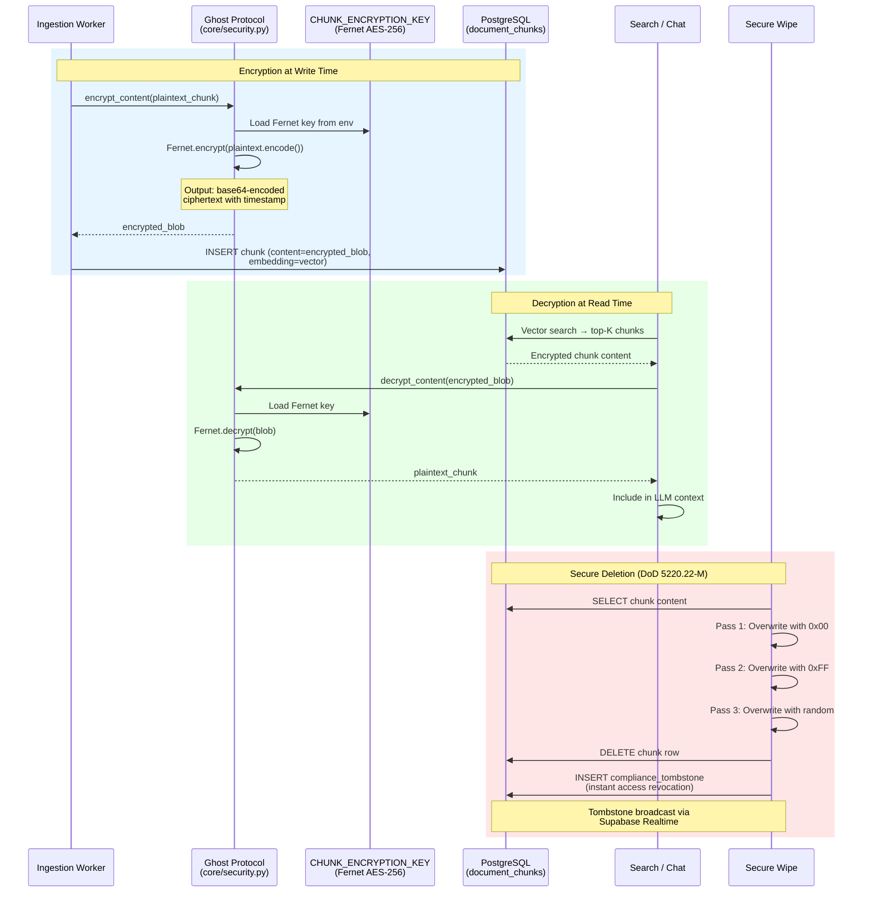

---

## 10. Consent & Compliance Flow

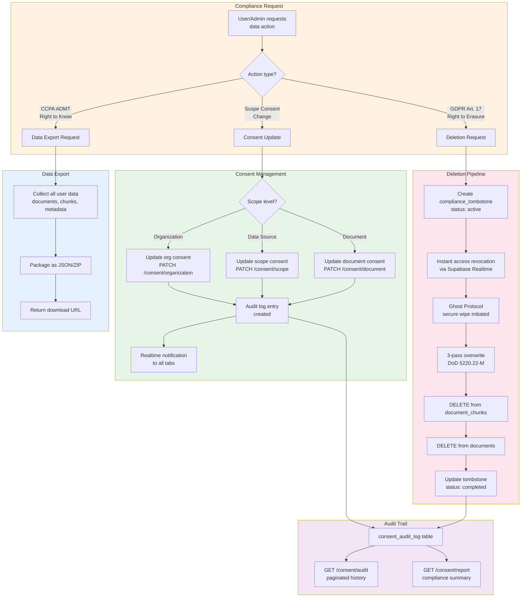

---

## 11. Team & RBAC Hierarchy

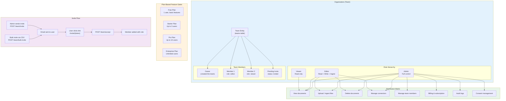

---

## 12. Billing & Subscription Flow

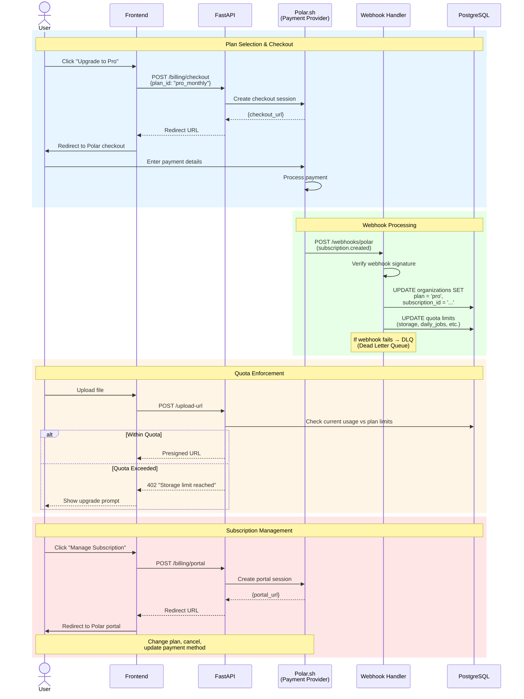

---

## 13. Frontend Component Architecture

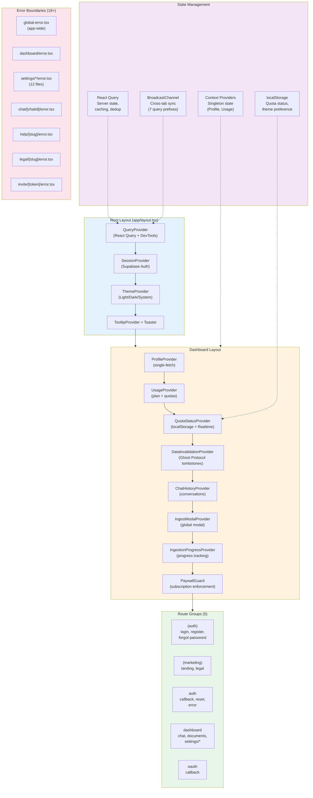

---

## 14. Docker Infrastructure

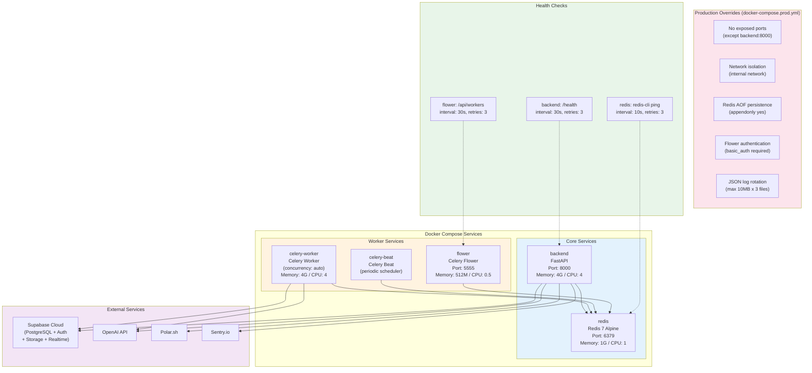

---

## 15. CI/CD Pipeline Flow

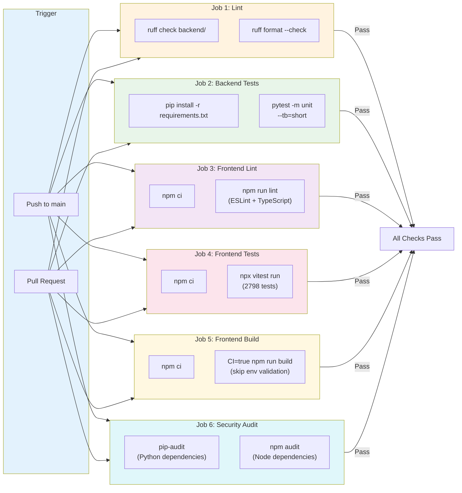

---

## Rendering Notes

- All diagrams use **Mermaid** syntax and can be rendered in:
  - GitHub Markdown (native support)
  - VS Code with Mermaid extension
  - Mermaid Live Editor: https://mermaid.live
  - Notion, Confluence, and most modern documentation platforms
- For slide decks: export as SVG/PNG from Mermaid Live Editor
- Recommended: Use dark theme for presentations (better contrast)
