# AxioHub Mimari Diyagramlar

> **Versiyon:** 1.0 | **Tarih:** Şubat 2026 | **Durum:** Üretim
>
> Bu belge, AxioHub platformuna ait tüm Mermaid mimari diyagramlarını içerir.
> Her diyagram, sunumlar ve slayt desteleri için bağımsız olarak oluşturulabilir.

---

## İçindekiler

1. [Sistem Mimarisi (Üst Düzey)](#1-sistem-mimarisi-üst-düzey)
2. [İstek Yaşam Döngüsü](#2-i̇stek-yaşam-döngüsü)
3. [Kimlik Doğrulama Akışı](#3-kimlik-doğrulama-akışı)
4. [OAuth Bağlayıcı Akışı](#4-oauth-bağlayıcı-akışı)
5. [Dosya Yükleme ve Veri İşleme Hattı](#5-dosya-yükleme-ve-veri-i̇şleme-hattı)
6. [Celery Görev Zinciri ve Kuyruk Topolojisi](#6-celery-görev-zinciri-ve-kuyruk-topolojisi)
7. [RAG Sohbet Akışı](#7-rag-sohbet-akışı)
8. [Güvenlik Katmanları (Derinlemesine Savunma)](#8-güvenlik-katmanları-derinlemesine-savunma)
9. [Ghost Protocol Şifreleme Akışı](#9-ghost-protocol-şifreleme-akışı)
10. [Onay ve Uyumluluk Akışı](#10-onay-ve-uyumluluk-akışı)
11. [Takım ve RBAC Hiyerarşisi](#11-takım-ve-rbac-hiyerarşisi)
12. [Faturalandırma ve Abonelik Akışı](#12-faturalandırma-ve-abonelik-akışı)
13. [Önyüz Bileşen Mimarisi](#13-önyüz-bileşen-mimarisi)
14. [Docker Altyapısı](#14-docker-altyapısı)
15. [CI/CD İş Hattı Akışı](#15-cicd-i̇ş-hattı-akışı)

---

## 1. Sistem Mimarisi (Üst Düzey)

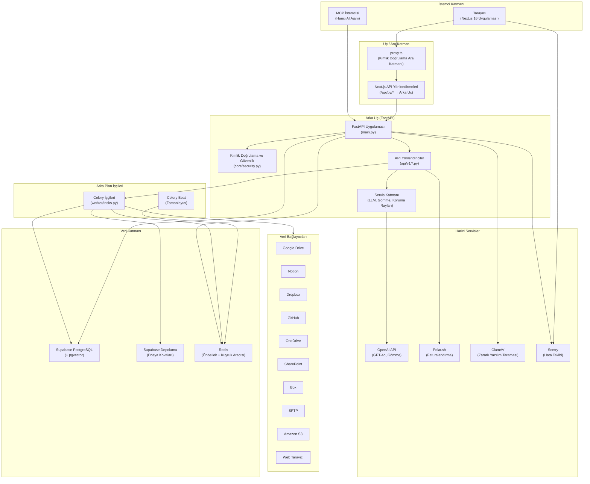

---

## 2. İstek Yaşam Döngüsü

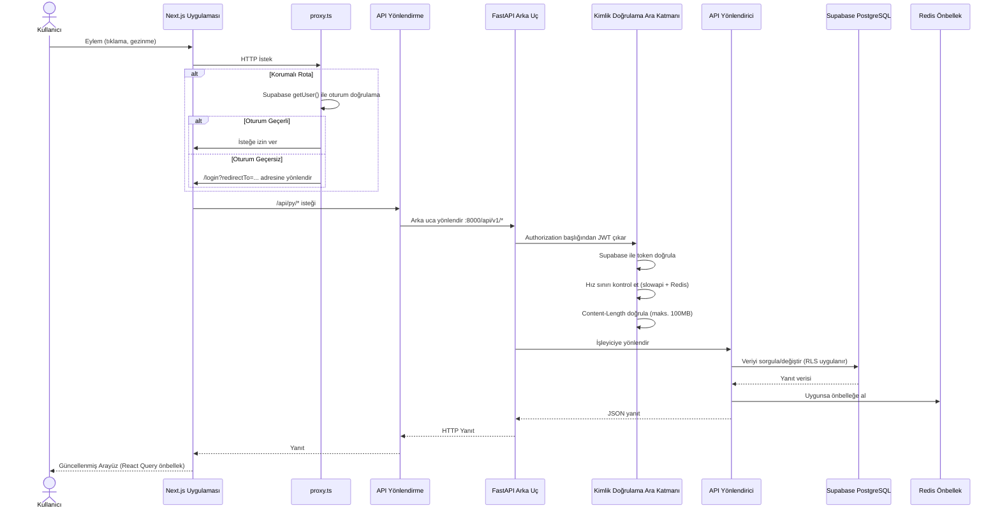

---

## 3. Kimlik Doğrulama Akışı

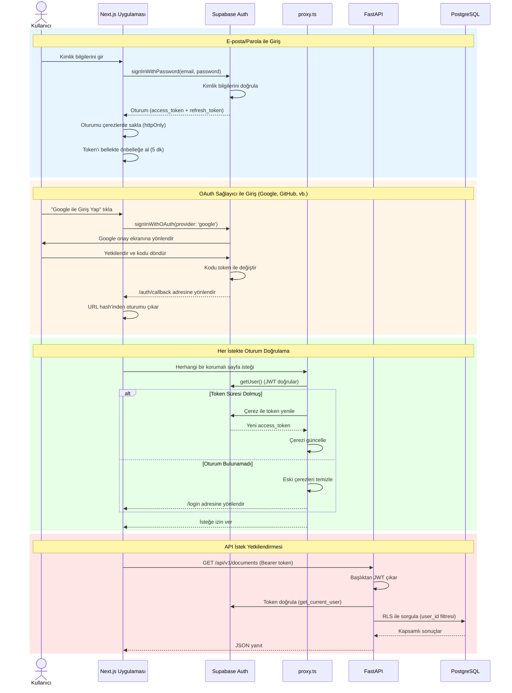

---

## 4. OAuth Bağlayıcı Akışı

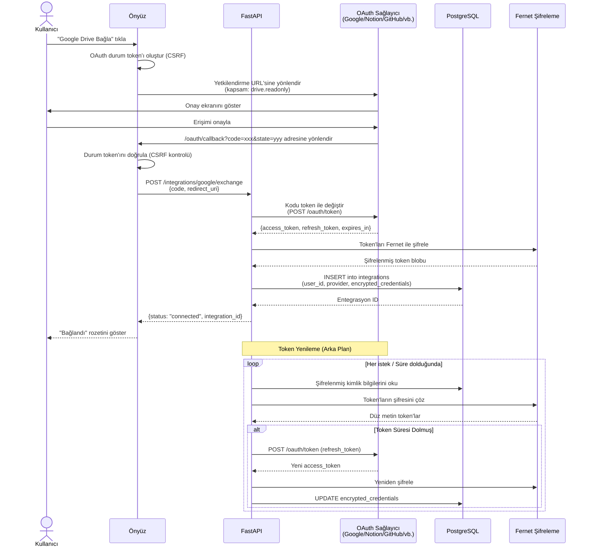

---

## 5. Dosya Yükleme ve Veri İşleme Hattı

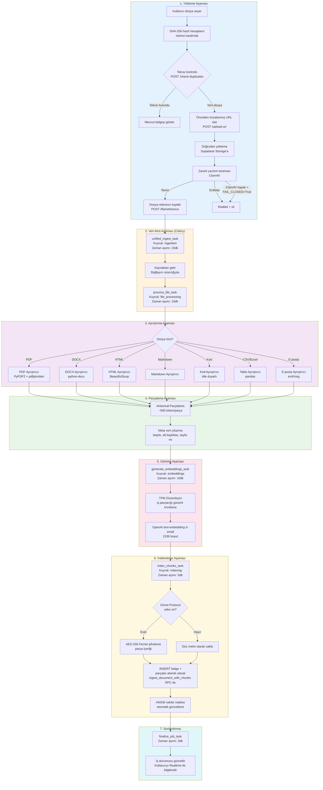

---

## 6. Celery Görev Zinciri ve Kuyruk Topolojisi

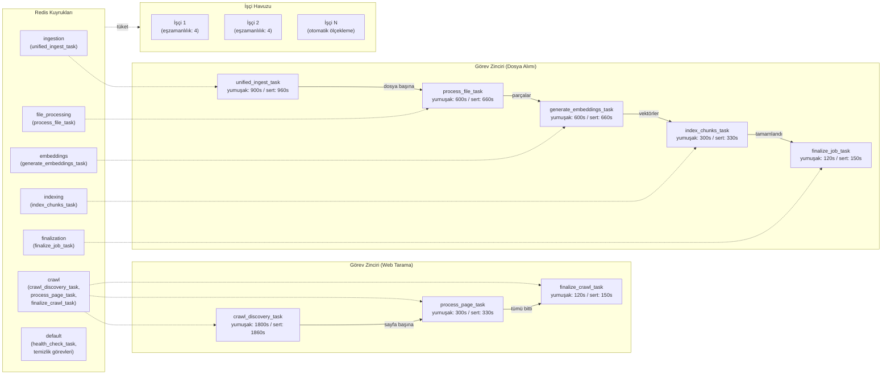

---

## 7. RAG Sohbet Akışı

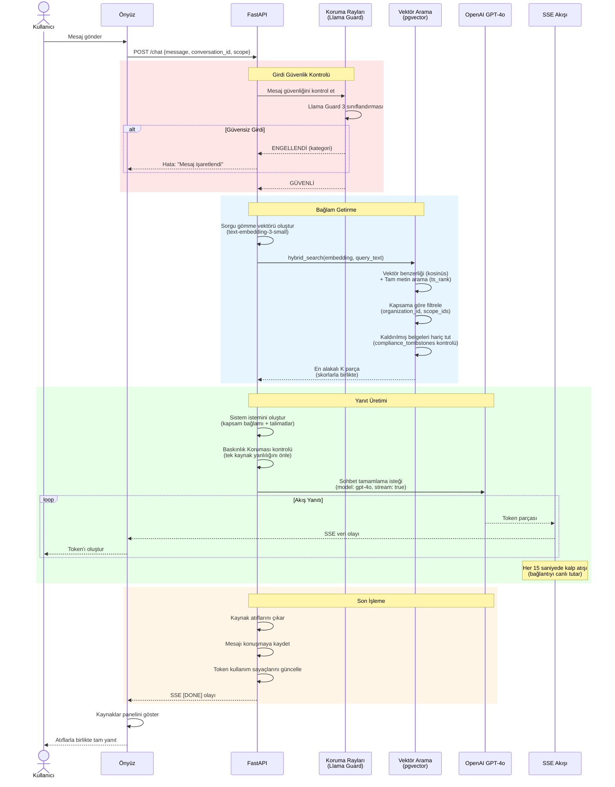

---

## 8. Güvenlik Katmanları (Derinlemesine Savunma)

```mermaid
graph TB
    subgraph L1["Katman 1: Ağ ve İletim"]
        HTTPS["Yalnızca HTTPS<br/>(HSTS ön yükleme)"]
        CORS["CORS Beyaz Listesi<br/>(belirli kaynaklar)"]
        CSP["İçerik Güvenliği Politikası<br/>(script-src, connect-src)"]
        XFrame["X-Frame-Options: DENY"]
        NoSniff["X-Content-Type-Options: nosniff"]
    end

    subgraph L2["Katman 2: Kimlik Doğrulama"]
        JWT["JWT Doğrulama<br/>(Supabase tarafından verilmiş)"]
        Session["Oturum Yönetimi<br/>(proxy.ts doğrulaması)"]
        TokenCache["Token Önbellekleme<br/>(5 dk bellek içi)"]
        OAuthState["OAuth Durum Token'ları<br/>(CSRF koruması)"]
    end

    subgraph L3["Katman 3: Yetkilendirme"]
        RLS["Satır Düzeyinde Güvenlik<br/>(PostgreSQL politikaları)"]
        RBAC["Rol Tabanlı Erişim<br/>(yönetici/editör/izleyici)"]
        PlanGate["Plan Bazlı Kapılar<br/>(require_plan bağımlılığı)"]
        ScopeGuard["Kapsam Koruması<br/>(veri kaynağı izolasyonu)"]
    end

    subgraph L4["Katman 4: Girdi Doğrulama"]
        RateLimit["Hız Sınırlama<br/>(slowapi uç nokta bazlı)"]
        BodySize["İstek Gövdesi Boyutu<br/>(maks. 100MB)"]
        Pydantic["Pydantic Doğrulama<br/>(max_length, Field())"]
        Sanitize["Girdi Temizleme<br/>(XSS önleme)"]
        OpenRedirect["Açık Yönlendirme Önleme<br/>(yol doğrulaması)"]
    end

    subgraph L5["Katman 5: Veri Koruma"]
        Fernet["Fernet AES-256<br/>(Ghost Protocol)"]
        TokenEncrypt["OAuth Token Şifreleme<br/>(durağan halde)"]
        Wipe["Güvenli Silme<br/>(DoD 5220.22-M 3 geçişli)"]
        Tombstone["Uyumluluk Mezar Taşları<br/>(anında erişim iptali)"]
    end

    subgraph L6["Katman 6: Çalışma Zamanı Koruması"]
        SSRF["SSRF Koruması<br/>(getaddrinfo + IP doğrulama)"]
        Malware["Zararlı Yazılım Taraması<br/>(ClamAV, hata durumunda kapat)"]
        Guardrails["LLM Koruma Rayları<br/>(Llama Guard 3)"]
        ConsoleGate["Konsol Kapılaması<br/>(üretimde sızıntı yok)"]
    end

    subgraph L7["Katman 7: İzleme"]
        SentryFE["Sentry (Önyüz)<br/>(istemci + uç)"]
        SentryBE["Sentry (Arka Uç)<br/>(sunucu)"]
        AuditLog["Denetim Günlüğü<br/>(tüm kritik eylemler)"]
        Health["Sağlık Uç Noktası<br/>(/health)"]
    end

    L1 --> L2 --> L3 --> L4 --> L5 --> L6 --> L7

    style L1 fill:#e3f2fd
    style L2 fill:#fff3e0
    style L3 fill:#f3e5f5
    style L4 fill:#e8f5e9
    style L5 fill:#fce4ec
    style L6 fill:#fff8e1
    style L7 fill:#e0f7fa
```

---

## 9. Ghost Protocol Şifreleme Akışı

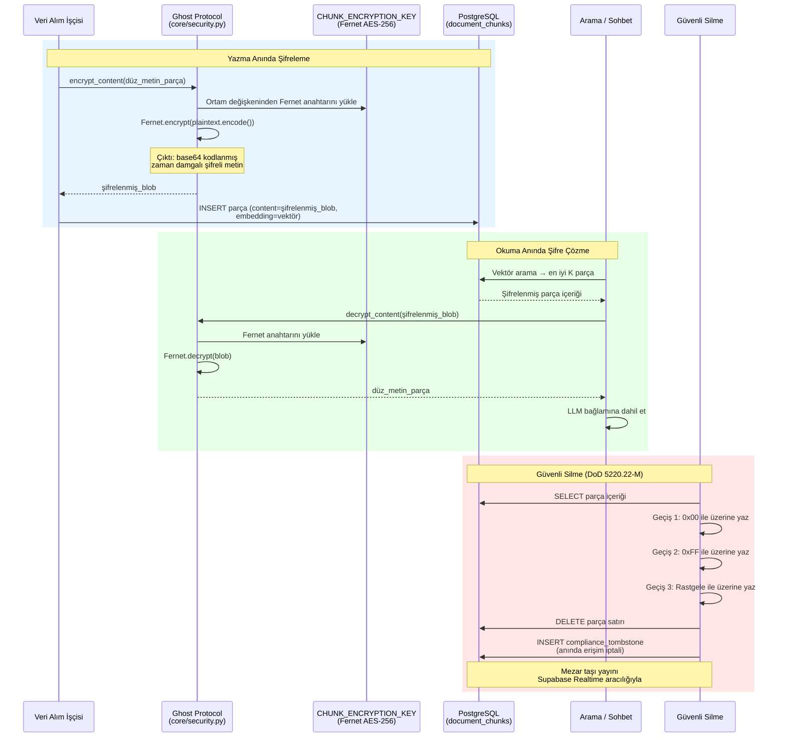

---

## 10. Onay ve Uyumluluk Akışı

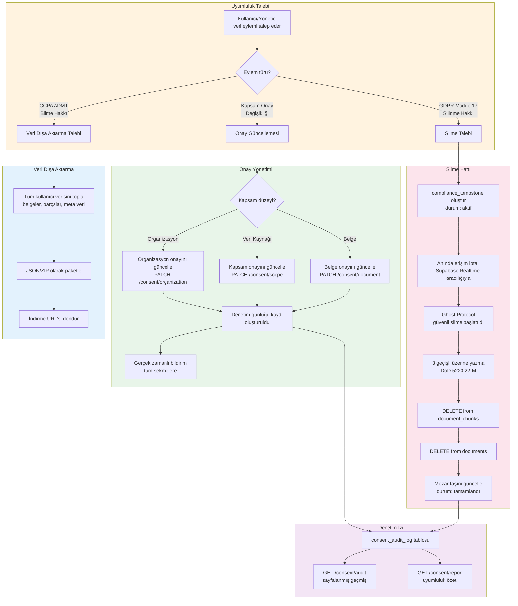

---

## 11. Takım ve RBAC Hiyerarşisi

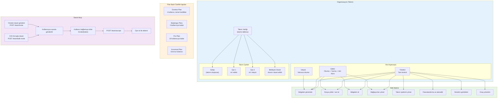

---

## 12. Faturalandırma ve Abonelik Akışı

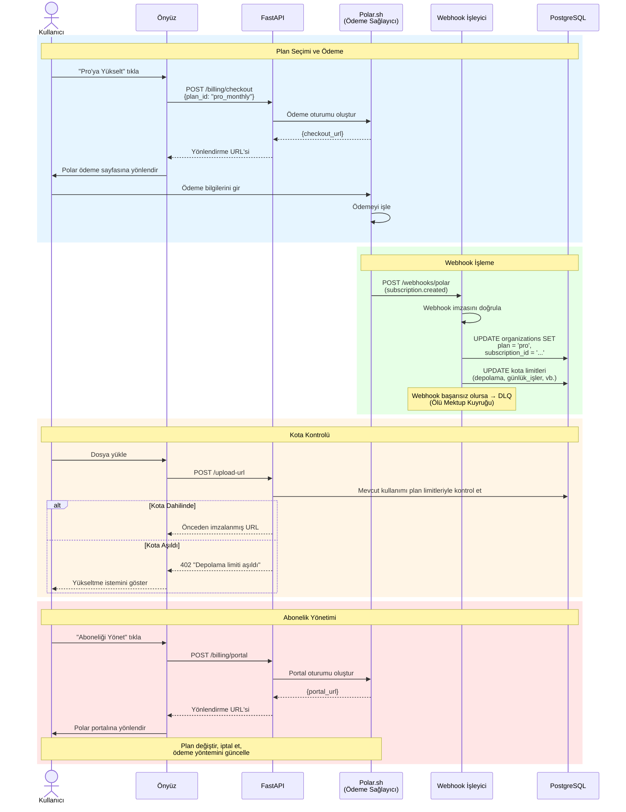

---

## 13. Önyüz Bileşen Mimarisi

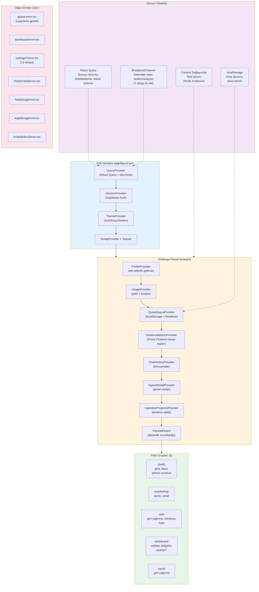

---

## 14. Docker Altyapısı

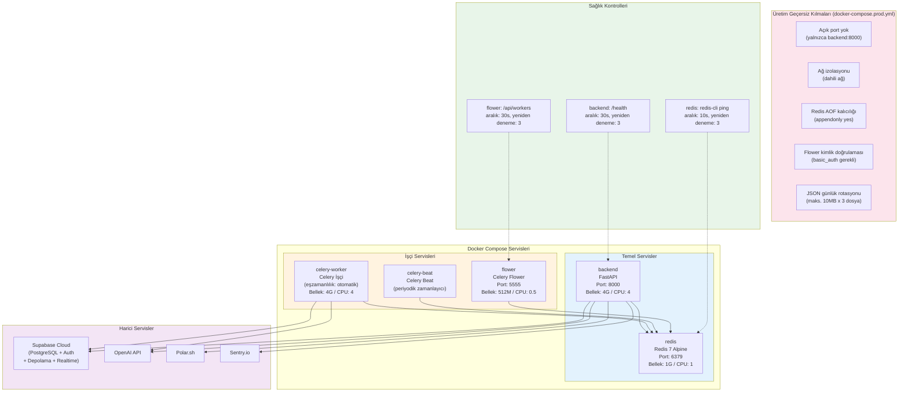

---

## 15. CI/CD İş Hattı Akışı

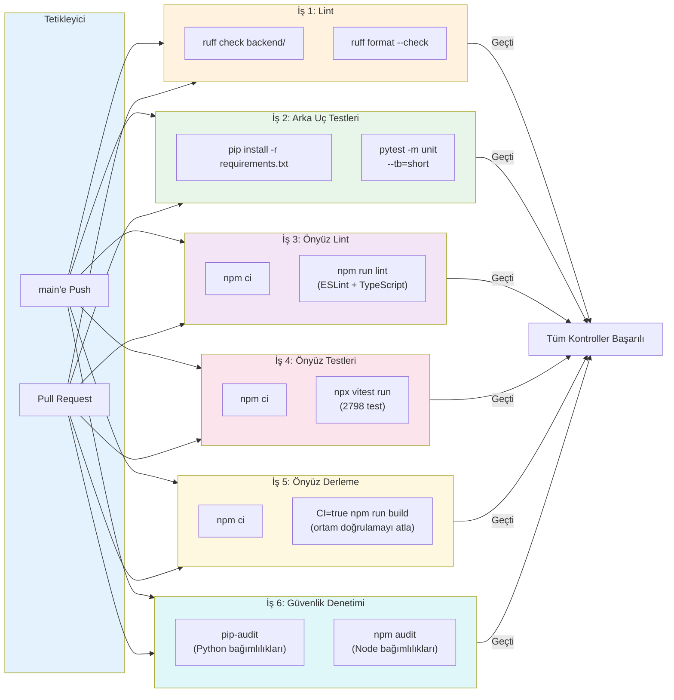

---

## Oluşturma Notları

- Tüm diyagramlar **Mermaid** söz dizimini kullanır ve aşağıdaki ortamlarda oluşturulabilir:
  - GitHub Markdown (yerel destek)
  - VS Code Mermaid uzantısı ile
  - Mermaid Canlı Düzenleyici: https://mermaid.live
  - Notion, Confluence ve diğer modern belgeleme platformları
- Slayt desteleri için: Mermaid Canlı Düzenleyici'den SVG/PNG olarak dışa aktarın
- Önerilen: Sunumlar için koyu tema kullanın (daha iyi kontrast)
