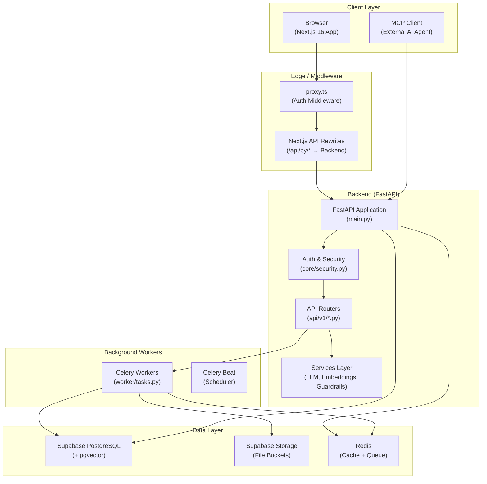
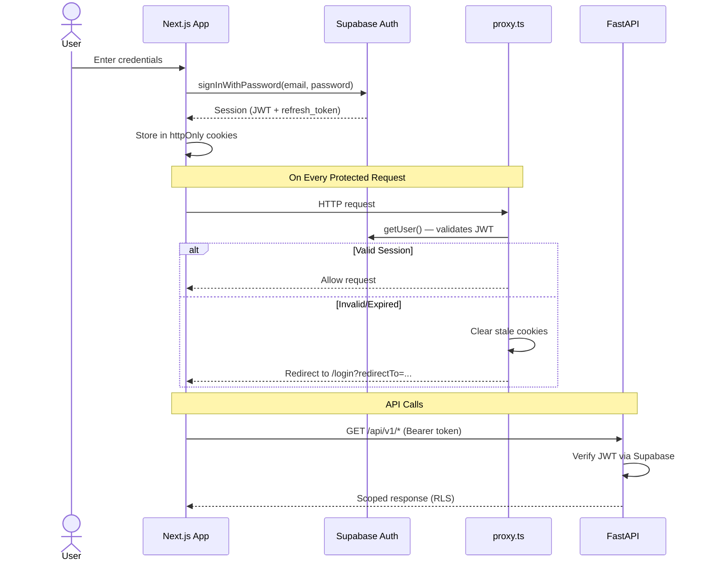
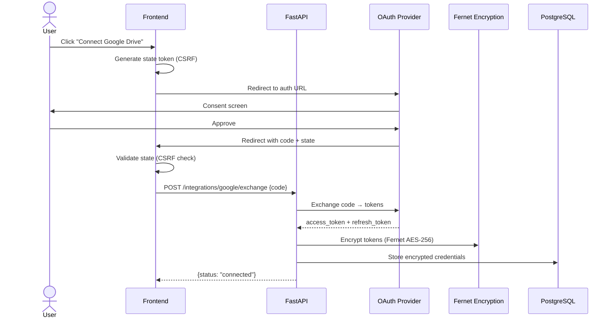
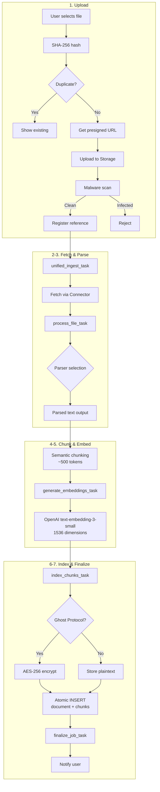
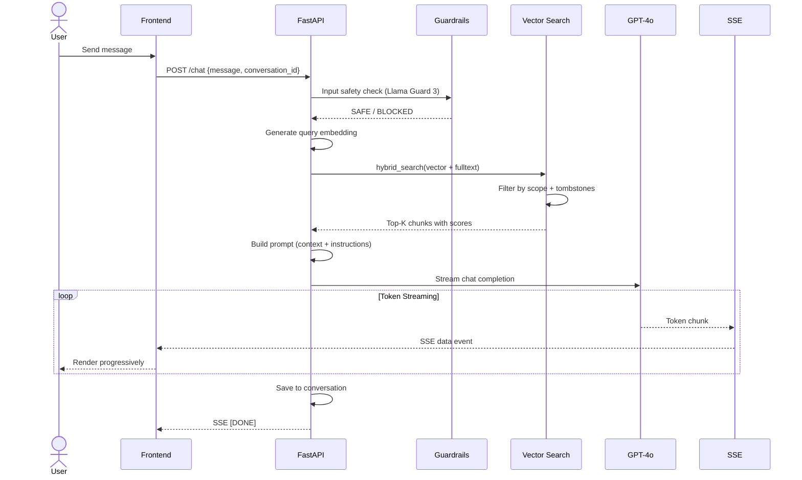
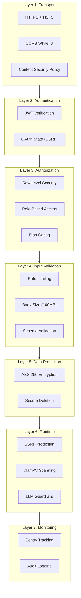
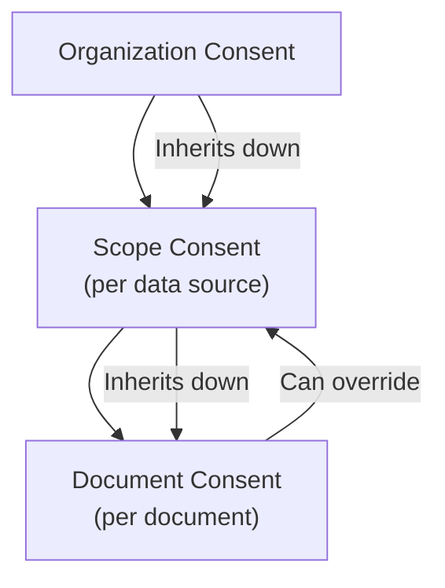
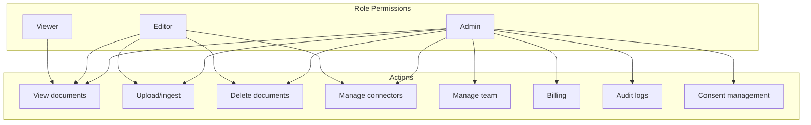
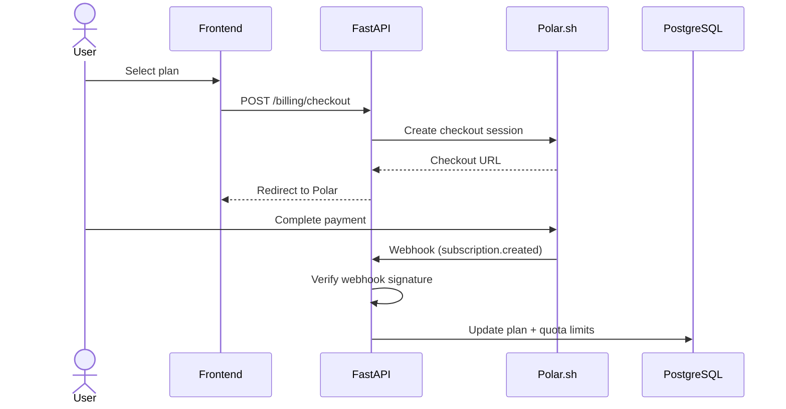
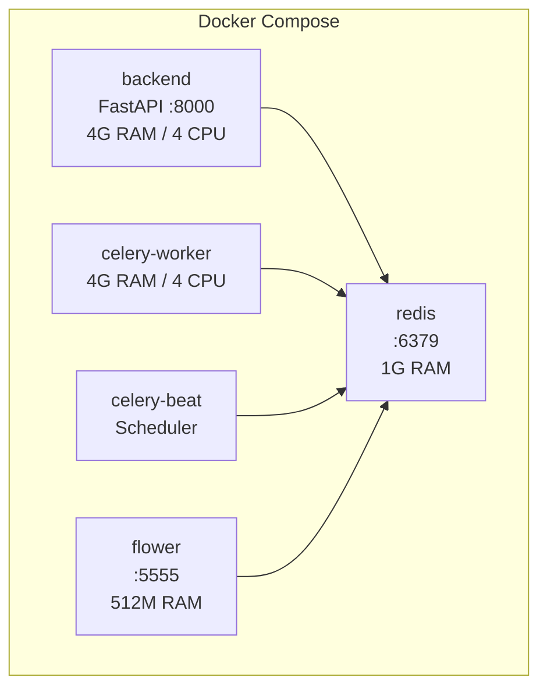

# AxioHub Product Documentation

> **Version:** 1.0 | **Date:** February 2026 | **Status:** Production
>
> Comprehensive technical and product documentation for the AxioHub RAG SaaS platform.
> This document covers architecture, workflows, security, compliance, and best practices.

---

## Table of Contents

1. [Executive Summary](#1-executive-summary)
2. [System Architecture Overview](#2-system-architecture-overview)
3. [Authentication & Session Management](#3-authentication--session-management)
4. [Data Connector System](#4-data-connector-system)
5. [File Processing Pipeline (Ingestion)](#5-file-processing-pipeline-ingestion)
6. [RAG Chat System](#6-rag-chat-system)
7. [Security Architecture](#7-security-architecture)
8. [Compliance & Consent Management](#8-compliance--consent-management)
9. [Team & Access Control](#9-team--access-control)
10. [Billing & Subscription](#10-billing--subscription)
11. [Frontend Architecture](#11-frontend-architecture)
12. [Infrastructure & Deployment](#12-infrastructure--deployment)
13. [Rules & Constraints](#13-rules--constraints)
14. [Best Practices Implemented](#14-best-practices-implemented)

---

## 1. Executive Summary

### What is AxioHub?

AxioHub is a **production-grade Retrieval-Augmented Generation (RAG) platform** that enables organizations to connect their data sources, process documents through an intelligent ingestion pipeline, and interact with their knowledge base through an AI-powered chat interface.

### Key Value Propositions

- **10+ Data Connectors**: Google Drive, Notion, Dropbox, GitHub, OneDrive, SharePoint, Box, SFTP, Amazon S3, and Web Crawler
- **Intelligent Ingestion**: Automated pipeline with deduplication, parsing, semantic chunking, embedding generation, and vector indexing
- **Enterprise Security**: AES-256 encryption at rest (Ghost Protocol), SSRF protection, malware scanning, DoD-grade secure deletion
- **Compliance Ready**: GDPR Article 17, CCPA ADMT, KVKK support with instant access revocation via compliance tombstones
- **Team Collaboration**: Role-based access control (admin/editor/viewer) with plan-based feature gating
- **Real-time Updates**: Supabase Realtime for instant notifications, job progress, and cross-tab synchronization

### Technology Stack

| Layer | Technology |
|-------|-----------|
| **Frontend** | Next.js 16.1.5 (App Router), TypeScript, Tailwind CSS, shadcn/ui, React Query |
| **Backend** | FastAPI (Python 3.12+), Celery (distributed task queue), slowapi (rate limiting) |
| **Database** | Supabase PostgreSQL + pgvector (HNSW indexing), Row Level Security |
| **Storage** | Supabase Storage (file buckets with presigned URLs) |
| **AI/ML** | OpenAI GPT-4o (chat), text-embedding-3-small (1536d), Llama Guard 3 (safety) |
| **Cache/Queue** | Redis 7 (caching, rate limiting, Celery broker) |
| **Billing** | Polar.sh (payment processing, subscription management) |
| **Monitoring** | Sentry (error tracking), Celery Flower (task monitoring) |
| **Infrastructure** | Docker Compose, GitHub Actions CI/CD |

---

## 2. System Architecture Overview

AxioHub follows a **layered architecture** with clear separation between the client, edge middleware, API backend, background workers, and data stores.



### Component Descriptions

| Component | File | Purpose |
|-----------|------|---------|
| **proxy.ts** | `frontend-new/proxy.ts` | Next.js 16 middleware for auth session validation, cookie management, and route protection |
| **API Rewrites** | `frontend-new/next.config.ts` | Proxies `/api/py/*` to the FastAPI backend at `:8000/api/v1/*` |
| **FastAPI App** | `backend/main.py` | Main application with CORS, rate limiting, and 16 router registrations |
| **Security Core** | `backend/core/security.py` | JWT verification, Fernet encryption |
| **API Routers** | `backend/api/v1/*.py` | 18 route modules with 100+ endpoints |
| **Celery Workers** | `backend/worker/tasks.py` | 11 task definitions across 6 queues |
| **Supabase** | Cloud-hosted | PostgreSQL, Auth, Storage, and Realtime channels |
| **Redis** | Docker service | Caching, rate limit counters, Celery message broker |

---

## 3. Authentication & Session Management

### 3.1 Authentication Flow

AxioHub uses **Supabase Auth** for identity management, supporting both email/password and OAuth provider login.



### 3.2 Session Management in proxy.ts

The `proxy.ts` file (`frontend-new/proxy.ts`) is the auth middleware for Next.js 16. It runs on every request and handles:

- **Session Validation**: Calls `supabase.auth.getUser()` (server-side, more secure than `getSession()`)
- **Route Classification**: Distinguishes excluded paths (`/_next`, `/api`), public paths (`/`, `/login`), and protected paths
- **Cookie Cleanup**: On `session_not_found` or invalid sessions, clears all stale auth cookies
- **Redirect Logic**: Sends unauthenticated users to `/login` with a `redirectTo` parameter for post-auth navigation
- **Auth Page Guard**: Redirects already-authenticated users away from `/login` and `/register` to the dashboard

### 3.3 Token Caching (Frontend)

The Axios client (`frontend-new/lib/api.ts`) implements **in-memory token caching** to avoid hitting Supabase on every API call:

- **Cache Duration**: Token cached in memory with 5-minute refresh buffer
- **Refresh Logic**: If token expires within 5 minutes, a fresh session is fetched (deduplicated)
- **401 Handling**: On 401 response, cached token is cleared and next request triggers re-auth
- **Logout**: `clearAuthCache()` is called on sign-out to prevent stale tokens

### 3.4 OAuth Providers

AxioHub supports sign-in via:
- Google (OAuth 2.0)
- GitHub (OAuth 2.0)
- Microsoft (PKCE flow for enhanced security)

The OAuth callback at `/auth/callback` validates the state token (CSRF protection) and extracts the session from the URL hash.

### 3.5 Open Redirect Prevention

The auth callback validates the `next` parameter to prevent open redirect attacks:
- Must start with `/`
- Must not start with `//`
- Must not contain `:` before the first `/`

---

## 4. Data Connector System

### 4.1 Connector Overview

AxioHub supports 10 data connectors, each registered in `backend/connectors/registry.py`:

| Connector | Auth Type | Capabilities | Rate Limit (RPM) | Notes |
|-----------|-----------|-------------|-------------------|-------|
| **Google Drive** | OAuth 2.0 | incremental_sync, binary_content | 600 | Drive API v3 |
| **Notion** | OAuth 2.0 | incremental_sync, html_content | 60 | Block-based content |
| **Dropbox** | OAuth 2.0 | binary_content, incremental_sync, team_spaces | 720 | Supports team folders |
| **GitHub** | OAuth 2.0 | code_aware, incremental_sync, text_content | 80 | Repository selection |
| **OneDrive** | OAuth 2.0 (PKCE) | binary_content, incremental_sync | 120 | Microsoft Graph API |
| **SharePoint** | OAuth 2.0 (PKCE) | binary_content, incremental_sync | 120 | Microsoft Graph API |
| **Box** | OAuth 2.0 | binary_content, incremental_sync, enterprise | 600 | Business/Enterprise |
| **SFTP** | Credentials (host/user/key) | binary_content, incremental_sync | 60 | SSH-based file access |
| **Amazon S3** | IAM Credentials | binary_content, incremental_sync, glacier_aware | 1000 | Enterprise-only |
| **Web Crawler** | None | crawl, sitemap | 120 | URL-based crawling |

### 4.2 Connector Architecture

All connectors extend the `EnhancedConnector` base class (`backend/connectors/enhanced.py`), which itself extends `BaseConnector`:

```
BaseConnector (abstract)
  ├── list_files(config, since) → Iterator[RemoteFile]
  ├── fetch_file_content(file_id, config) → bytes
  ├── validate_config(config) → bool
  └── validate_credentials(credentials) → bool

EnhancedConnector(BaseConnector) (abstract)
  ├── fetch_documents(item_ids, credentials) → AsyncIterator[SourceDocument]
  ├── fetch_documents_sync(item_ids, credentials) → Iterator[SourceDocument]
  └── authorize(user_id) → bool
```

The `SourceDocument` dataclass is the standardized contract between connectors and the ingestion pipeline:

| Field | Type | Description |
|-------|------|-------------|
| `content` | `bytes \| str` | Raw content (binary or text) |
| `metadata` | `dict` | Source-specific metadata |
| `source_type` | `SourceType` | Enum: google_drive, notion, web, etc. |
| `source_id` | `str` | Unique ID in the source system |
| `filename` | `str` | Display name |
| `mime_type` | `str` | MIME type |
| `size_bytes` | `int` | Content size |
| `parent_id` | `str \| None` | Parent document (hierarchical sources) |

### 4.3 OAuth Connection Flow



### 4.4 Token Encryption & Refresh

All OAuth tokens are encrypted at rest using **Fernet symmetric encryption** (AES-256-CBC with HMAC):

- **Storage**: Encrypted blob stored in the `integrations` table
- **Decryption**: Happens on-demand when a connector needs to access the provider
- **Refresh**: If the access token is expired, the refresh token is used to obtain a new one, which is re-encrypted and stored
- **Key**: `ENCRYPTION_KEY` environment variable (separate from Ghost Protocol's `CHUNK_ENCRYPTION_KEY`)

### 4.5 Microsoft PKCE Flow

OneDrive and SharePoint use **PKCE (Proof Key for Code Exchange)** for enhanced OAuth security:

1. Frontend generates a `code_verifier` (random 43-128 character string)
2. Computes `code_challenge` = SHA-256 hash of verifier
3. Includes `code_challenge` and `code_challenge_method=S256` in the authorization URL
4. Backend sends `code_verifier` when exchanging the authorization code
5. Microsoft validates that the verifier matches the original challenge

---

## 5. File Processing Pipeline (Ingestion)

### 5.1 Pipeline Overview

The ingestion pipeline transforms raw files from any source into searchable, vector-indexed document chunks. It consists of 7 phases:



### 5.2 Presigned URL Upload Flow

File uploads bypass the backend for improved performance:

1. **Client**: Computes SHA-256 hash of the file
2. **Client → Backend**: `POST /uploads/check-duplicates` with `{sha256_hash, filename, size}`
3. **Backend**: Checks for existing documents with the same hash
4. **Client → Backend**: `POST /uploads/upload-url` to get a presigned URL
5. **Client → Storage**: Direct upload to Supabase Storage via presigned URL
6. **Client → Backend**: `POST /uploads/file/reference` to register the file and trigger ingestion

### 5.3 Parser Selection

The pipeline selects a parser based on file MIME type:

| File Type | Parser | Library |
|-----------|--------|---------|
| PDF | PDF Parser | PyPDF2 + pdfplumber |
| DOCX | DOCX Parser | python-docx |
| DOC | Legacy Word Parser | antiword fallback |
| XLSX/XLS | Spreadsheet Parser | pandas + openpyxl |
| PPTX | Presentation Parser | python-pptx |
| HTML | HTML Parser | BeautifulSoup4 |
| Markdown | Markdown Parser | Built-in |
| CSV | Tabular Parser | pandas |
| JSON/XML | Structured Parser | Built-in |
| EML/MSG | Email Parser | email + extract-msg |
| Code files | Code Parser | Language-aware (Python, JS, etc.) |

### 5.4 Celery Task Chain

Each ingestion triggers a chain of Celery tasks with dedicated queues and timeouts:

| Task | Queue | Soft Limit | Hard Limit | Purpose |
|------|-------|------------|------------|---------|
| `unified_ingest_task` | ingestion | 900s (15min) | 960s | Orchestrate the full pipeline |
| `process_file_task` | file_processing | 600s (10min) | 660s | Fetch, parse, and chunk a single file |
| `generate_embeddings_task` | embeddings | 600s (10min) | 660s | Generate vectors via OpenAI |
| `index_chunks_task` | indexing | 300s (5min) | 330s | Store chunks in PostgreSQL |
| `finalize_job_task` | finalization | 120s (2min) | 150s | Update job status, notify user |

**Web Crawl Tasks:**

| Task | Queue | Soft Limit | Hard Limit | Purpose |
|------|-------|------------|------------|---------|
| `crawl_discovery_task` | crawl | 1800s (30min) | 1860s | Discover pages via sitemap/links |
| `process_page_task` | crawl | 300s (5min) | 330s | Process a single web page |
| `finalize_crawl_task` | crawl | 120s (2min) | 150s | Finalize crawl results |

### 5.5 Embedding Generation

- **Model**: OpenAI `text-embedding-3-small` (1536 dimensions)
- **TPM Regulation**: Thread-safe rate limiter (`threading.Lock()`) to stay within OpenAI's tokens-per-minute limits
- **Batch Processing**: Chunks are batched to maximize throughput while respecting TPM limits
- **Retry Logic**: Celery's built-in retry with exponential backoff

### 5.6 Vector Indexing

- **Index Type**: HNSW (Hierarchical Navigable Small World) via pgvector
- **Parameters**: `m=16`, `ef_construction=64` (balance of memory vs recall)
- **Distance**: Cosine similarity (`vector_cosine_ops`)
- **Atomic Ingestion**: Document + chunks are inserted in a single transaction via the `ingest_document_with_chunks` RPC function

---

## 6. RAG Chat System

### 6.1 Chat Flow



### 6.2 Hybrid Search

The search combines vector similarity with full-text search for optimal relevance:

1. **Vector Search**: Query embedding compared to chunk embeddings using cosine similarity (pgvector)
2. **Full-Text Search**: PostgreSQL `ts_rank` for keyword matching
3. **Score Fusion**: Combined ranking from both methods
4. **Scope Filtering**: Results limited to the user's organization and permitted scopes
5. **Tombstone Exclusion**: Compliance tombstones checked to exclude deleted documents

### 6.3 Scope-Aware Search

Search results are scoped to prevent data leakage:

- **Organization Scope**: All queries are filtered by `organization_id` (RLS enforced)
- **Data Source Scope**: Users can restrict search to specific connectors/sources
- **Document Consent**: Only documents with active consent are included
- **Dominance Guard**: Prevents a single data source from dominating results

### 6.4 Model Configuration

| Purpose | Model | Notes |
|---------|-------|-------|
| **Chat (Primary)** | GPT-4o | Main response generation, streaming |
| **Chat (Fast)** | GPT-4o-mini | Lower latency for simple queries |
| **Embeddings** | text-embedding-3-small | 1536 dimensions, cost-effective |
| **Guardrails** | Llama Guard 3 | Input/output safety classification |

### 6.5 Streaming SSE

The chat endpoint uses **Server-Sent Events (SSE)** for real-time token streaming:

- **Heartbeat**: Sent every 15 seconds to keep the connection alive
- **Data Events**: Each token chunk sent as `data: {"content": "..."}`
- **Done Signal**: `data: [DONE]` signals the end of the response
- **Error Handling**: Errors sent as SSE events with appropriate error codes

---

## 7. Security Architecture

### 7.1 Security Layers Overview

AxioHub implements **7 layers of defense in depth**:



### 7.2 Ghost Protocol (Encryption at Rest)

Ghost Protocol is AxioHub's encryption-at-rest system for document chunk content:

- **Algorithm**: Fernet (AES-256-CBC with HMAC-SHA256)
- **Key**: `CHUNK_ENCRYPTION_KEY` environment variable
- **Scope**: All document chunk content stored in `document_chunks.content`
- **Encryption**: Applied during ingestion (in `index_chunks_task`)
- **Decryption**: Applied during search/chat (on retrieval from database)
- **Strict Mode**: When enabled, rejects any unencrypted chunk reads

**Key Management:**
- Key must be backed up in at least 2 secure locations
- If the key is lost, all encrypted data is **permanently unrecoverable**
- Key rotation requires decrypt-all + re-encrypt migration

### 7.3 SSRF Protection

The `_enforce_public_endpoint` function in `connectors/web.py` prevents Server-Side Request Forgery:

1. **DNS Resolution**: Uses `getaddrinfo()` (not `gethostbyname()`) to resolve ALL DNS records
2. **IP Validation**: Every resolved IP is checked against `_is_public_ip()`:
   - Blocks private ranges (10.x, 172.16-31.x, 192.168.x)
   - Blocks loopback (127.x)
   - Blocks link-local (169.254.x)
   - Blocks reserved, multicast, and unspecified addresses
3. **All Records Checked**: Even if one IP is public, if any resolved IP is private, the request is blocked

### 7.4 Malware Scanning

- **Engine**: ClamAV (via `clamd` socket)
- **Trigger**: All file uploads scanned before ingestion
- **Fail-Closed**: When `MALWARE_SCAN_FAIL_CLOSED=True` (production default), uploads are **rejected** if ClamAV is unavailable
- **Integration**: Scanning happens between upload and file reference registration

### 7.5 Rate Limiting

Rate limiting is implemented via **slowapi** (built on limits library) backed by Redis:

| Endpoint Category | Limit | Notes |
|-------------------|-------|-------|
| Chat / Stream | 30/minute | Per user |
| Document operations | 60/minute | CRUD operations |
| File upload | 30/minute | Includes duplicate check |
| Integrations | 30/minute | OAuth + ingest |
| Team operations | 30/minute | Invite, role changes |
| Billing | 10/minute | Checkout, portal |
| Admin endpoints | 30/minute | Audit logs, security |
| Health checks | 60/minute | Monitoring |
| Job operations | 10-60/minute | Varies by action |

### 7.6 Secure File Deletion (DoD 5220.22-M)

When a user or compliance request triggers document deletion:

1. **Pass 1**: Overwrite content with `0x00` (zeros)
2. **Pass 2**: Overwrite content with `0xFF` (ones)
3. **Pass 3**: Overwrite content with random bytes
4. **DELETE**: Remove the row from the database
5. **Tombstone**: Insert `compliance_tombstone` for instant access revocation

### 7.7 Frontend Security Headers

Configured in `frontend-new/next.config.ts`:

| Header | Value | Purpose |
|--------|-------|---------|
| `Strict-Transport-Security` | `max-age=31536000; includeSubDomains; preload` | Force HTTPS for 1 year |
| `X-Frame-Options` | `DENY` | Prevent clickjacking |
| `X-Content-Type-Options` | `nosniff` | Prevent MIME sniffing |
| `Referrer-Policy` | `strict-origin-when-cross-origin` | Control referrer info |
| `Permissions-Policy` | `camera=(), microphone=(), geolocation=()` | Disable dangerous APIs |
| `Content-Security-Policy` | Comprehensive whitelist | Script, style, connect sources |

### 7.8 Row Level Security (RLS)

All critical tables have RLS enabled in Supabase PostgreSQL:

- **documents**: Users can only access documents in their organization
- **document_chunks**: Scoped to parent document's organization
- **integrations**: User-specific connector credentials
- **audit_logs**: Service role only (backend writes, no direct user access)
- **compliance_tombstones**: Organization-scoped, service role for writes

---

## 8. Compliance & Consent Management

### 8.1 Compliance Framework

AxioHub supports three compliance frameworks:

| Framework | Scope | Key Rights |
|-----------|-------|-----------|
| **GDPR Article 17** | EU data subjects | Right to erasure, data portability |
| **CCPA ADMT** | California consumers | Right to know, delete, opt-out |
| **KVKK** | Turkish data subjects | Personal data protection |

### 8.2 Consent Management

Consent is managed at three levels with inheritance:



**API Endpoints:**
- `GET /consent/organization` — Get org-level consent
- `PATCH /consent/organization` — Update org consent
- `GET /consent/scope` — Get scope-level consent
- `PATCH /consent/scope` — Update scope consent
- `POST /consent/scope/bulk` — Bulk update scopes
- `GET /consent/document/{id}` — Get document consent
- `PATCH /consent/document/{id}` — Update document consent
- `PATCH /consent/scope/agents` — Update AI agent access per scope
- `PATCH /consent/document/{id}/agents` — Update AI agent access per document

### 8.3 Compliance Tombstones

When data is deleted for compliance, a **tombstone** is created for instant access revocation:

1. **INSERT tombstone** → Data immediately blocked from search/retrieval (10-20ms)
2. **Supabase Realtime** broadcasts to all connected clients
3. **Ghost Protocol** secure wipe initiated (3-pass overwrite)
4. **Tombstone status** updated to `completed`

Tombstone schema supports:
- Resource types: `document`, `scope`, `organization`, `user`
- Compliance types: `gdpr_art17`, `ccpa_admt`, `kvkk`, `user_request`
- GIN-indexed arrays for fast containment checks in search queries

### 8.4 Audit Trail

All consent changes and compliance actions are logged:

- `GET /consent/audit` — Paginated audit log of consent changes
- `GET /consent/report` — Compliance summary report
- `GET /audit-logs` — General audit logs (admin)
- `GET /security-log` — Security events (login, IP changes)

---

## 9. Team & Access Control

### 9.1 Role-Based Access Control



### 9.2 Team Management

| Action | Endpoint | Required Role |
|--------|----------|---------------|
| Get team info | `GET /team` | Any member |
| Update team | `PATCH /team` | Admin |
| Delete team | `DELETE /team` | Admin (owner) |
| List members | `GET /team/members` | Any member |
| Invite member | `POST /team/invite` | Admin |
| Bulk invite (CSV) | `POST /team/bulk-invite` | Admin |
| Add member | `POST /team/members` | Admin |
| Update role | `PATCH /team/members/{id}` | Admin |
| Remove member | `DELETE /team/members/{id}` | Admin |
| Resend invite | `POST /team/members/{id}/resend` | Admin |
| Accept invite | `POST /team/accept` | Invited user |
| My invites | `GET /team/my-invites` | Any user |
| Team stats | `GET /team/stats` | Any member |

### 9.3 Invite Flow

1. Admin invites user via email (`POST /team/invite`)
2. System sends email with invite link (`/invite/{token}`)
3. User clicks link and sees invite details
4. User accepts invite (`POST /team/accept`)
5. User is added with assigned role
6. Bulk invites supported via CSV upload (`POST /team/bulk-invite`)

### 9.4 Plan-Based Feature Gating

Features are gated by subscription plan using the `require_plan` dependency:

| Feature | Free | Starter | Pro | Enterprise |
|---------|------|---------|-----|-----------|
| Documents | Limited | Standard | Extended | Unlimited |
| Team members | 1 | 3 | 10 | Unlimited |
| Web crawling | No | Yes | Yes | Yes |
| Premium models | No | No | Yes | Yes |
| S3 connector | No | No | No | Yes |
| Custom branding | No | No | No | Yes |

---

## 10. Billing & Subscription

### 10.1 Billing Flow



### 10.2 Subscription Plans

| Feature | Free | Starter | Pro | Enterprise |
|---------|------|---------|-----|-----------|
| **Price** | $0 | $19/mo | $49/mo | Custom |
| **Storage** | 100MB | 1GB | 10GB | Unlimited |
| **Daily jobs** | 5 | 50 | 200 | Unlimited |
| **Team members** | 1 | 3 | 10 | Unlimited |
| **Connectors** | 2 | 5 | All | All + S3 |
| **Web crawling** | No | Yes | Yes | Yes |
| **Premium models** | No | No | Yes | Yes |
| **Priority support** | No | No | Yes | Yes |

### 10.3 Quota Enforcement

Quotas are checked at multiple points:
- **Upload**: Storage limit checked before presigned URL generation
- **Ingestion**: Daily job count checked before task dispatch
- **Embedding**: TPM (tokens per minute) regulated per plan
- **Team**: Member count checked before invite

When a quota is exceeded, the API returns HTTP 402 with a descriptive error message, and the frontend shows an upgrade prompt.

### 10.4 Webhook Processing

Polar.sh webhooks are processed at `POST /webhooks/polar`:
- **Signature verification**: Every webhook is cryptographically verified
- **Supported events**: `subscription.created`, `subscription.updated`, `subscription.cancelled`, `order.completed`
- **Dead Letter Queue**: Failed webhooks are stored in a DLQ for retry
- **Idempotency**: Duplicate webhooks are safely ignored

---

## 11. Frontend Architecture

### 11.1 Route Structure

The Next.js 16 app uses the App Router with 5 route groups:

| Group | Layout | Pages | Purpose |
|-------|--------|-------|---------|
| **(auth)** | Auth layout | login, register, forgot-password | Authentication pages |
| **(marketing)** | Marketing layout | landing, legal/[slug] | Public pages |
| **auth** | None | callback, reset-password, auth-code-error | Auth handlers |
| **dashboard** | Dashboard layout | chat, documents, settings/*, help | Protected app |
| **oauth** | None | callback | OAuth redirect handler |

### 11.2 Provider Stack

The dashboard layout wraps all protected routes in a deeply nested provider stack:

```
<QueryProvider>                     ← React Query (5min stale, 10min gc)
  <SessionProvider>                 ← Supabase auth state
    <ThemeProvider>                  ← Light/dark/system theme
      <ProfileProvider>             ← User profile (single-fetch)
        <UsageProvider>             ← Plan + quotas (singleton)
          <QuotaStatusProvider>     ← Per-source quota (localStorage)
            <DataInvalidationProvider>  ← Ghost Protocol tombstones
              <ChatHistoryProvider>     ← Conversations (plan-gated)
                <IngestModalProvider>   ← Global upload modal
                  <IngestionProgressProvider>  ← Progress tracking
                    <PaywallGuard>      ← Subscription enforcement
                      {children}
```

### 11.3 State Management

| Pattern | Tool | Use Case |
|---------|------|----------|
| **Server State** | React Query (TanStack) | API data, caching, dedup, optimistic updates |
| **Singleton State** | Context Providers | Profile, usage, quota (one fetch per session) |
| **Local Persistence** | localStorage | Theme, quota status, tab IDs |
| **Cross-Tab Sync** | BroadcastChannel | Syncs user, profile, team, notifications, usage, quota, settings |
| **Real-Time** | Supabase Realtime | Tombstones, job status, notifications |

### 11.4 Request Deduplication

React Strict Mode and multiple components can cause duplicate API calls. The `lib/request-dedup.ts` module provides:

- `dedupedRequest(key, fetcher)` — Multiple calls with the same key within 100ms reuse a single promise
- `createDedupedQueryFn(queryKey, fetcher)` — React Query wrapper
- Used in Profile, Usage, and other singleton fetches

### 11.5 Cross-Tab Synchronization

The `lib/crossTabSync.ts` module uses the BroadcastChannel API:

- When one tab updates data, it broadcasts an invalidation message
- Other tabs receive the message and invalidate their React Query cache
- **Allowlist**: Only lightweight queries are synced (user, profile, team, notifications, usage, quota, settings)
- **Excluded**: Documents, search, feedback (too large for BroadcastChannel)

### 11.6 Error Boundary Strategy

18+ error boundary files provide per-section error recovery:

| Scope | File | Behavior |
|-------|------|----------|
| **App-wide** | `global-error.tsx` | Full-page error with Sentry |
| **Dashboard** | `dashboard/error.tsx` | Dashboard-level recovery |
| **Chat** | `chat/[chatId]/error.tsx` | Per-chat error |
| **Help** | `help/[slug]/error.tsx` | Per-article error |
| **Legal** | `legal/[slug]/error.tsx` | Per-legal-page error |
| **Invite** | `invite/[token]/error.tsx` | Per-invite error |
| **Settings (12)** | `settings/*/error.tsx` | Per-settings-section recovery |

Each error boundary:
- Catches React rendering errors
- Reports to Sentry with component stack
- Provides "Try Again" button (triggers reset)
- Shows user-friendly error message

### 11.7 Custom Hooks

Key hooks organized by domain:

**Authentication:** `useAuth`, `useProfile`

**Data Management:** `useChatHistory`, `useDocuments`, `useSearch`, `useDocumentCount`, `useDataInvalidation`, `useFileStatus`

**Usage & Quotas:** `useUsage`, `useQuotaStatus`

**Notifications:** `useNotifications`, `useNotificationSettings`

**Ingestion:** `useIngestionJobs`, `useIngestionProgress`, `useIngestModal`

**Team:** `useTeamMembers`, `usePendingInvites`

**Compliance:** `useApprovals`, `useConsent`, `useAuditLogs`, `useSecurityLog`

**UI:** `useTheme`, `useMobile`, `useDirtyForm`, `useOnboarding`, `useNetworkStatus`, `useRealtimeStatus`

---

## 12. Infrastructure & Deployment

### 12.1 Docker Architecture



### 12.2 Production vs Development

| Aspect | Development | Production |
|--------|-------------|------------|
| **Ports** | All exposed (8000, 5555, 6379) | Only backend:8000 |
| **Network** | Default bridge | Internal isolated network |
| **Redis** | Ephemeral | AOF persistence enabled |
| **Flower** | No auth | Basic auth required |
| **Logs** | Console output | JSON rotation (10MB x 3) |
| **Restart** | No restart policy | `unless-stopped` on all |
| **Env validation** | Skipped (CI=true) | Full validation at build |

### 12.3 CI/CD Pipeline

6 parallel jobs in `.github/workflows/ci.yml`:

| Job | Tool | Purpose |
|-----|------|---------|
| **Lint** | ruff | Python linting + formatting |
| **Backend Test** | pytest | Unit tests (`-m unit`) |
| **Frontend Lint** | ESLint + TS | TypeScript + lint checks |
| **Frontend Test** | Vitest | 2,798 frontend tests |
| **Frontend Build** | Next.js | Build validation |
| **Security Audit** | pip-audit + npm audit | Dependency vulnerabilities |

### 12.4 Health Check Endpoints

**Active endpoint** (defined inline in `main.py`):

| Endpoint | Purpose | Response |
|----------|---------|----------|
| `GET /health` | DB + Redis connectivity check | `{status, version, environment, services, issues}` |

Returns `200 OK` if DB is healthy (Redis down = degraded but still `200`). Returns `503` only if database is unreachable.

> **Note:** `backend/api/v1/health.py` defines additional Kubernetes-style probes (`/health/ready`, `/health/live`, `/health/startup`) but this router is not registered in `main.py`. These are prepared for future K8s deployment.

### 12.5 Monitoring

- **Sentry**: Configured for client (browser), server (Next.js API routes), and edge (middleware)
- **Flower**: Celery task monitoring dashboard (port 5555)
- **Audit Logs**: All critical actions logged to `audit_logs` table
- **Health Checks**: Docker health checks on backend (30s interval), Redis (10s interval), Flower (30s interval)

---

## 13. Rules & Constraints

### 13.1 File Size Limits

| Constraint | Value |
|-----------|-------|
| Max upload size | 100 MB (Content-Length middleware) |
| Max file size for parsing | Plan-dependent |
| Request body limit | 100 MB |

### 13.2 Rate Limits (per user, per minute)

| Category | Rate |
|----------|------|
| Chat / Stream | 30/min |
| Document CRUD | 60/min |
| File upload | 30/min |
| Integrations | 30/min |
| Team operations | 30/min |
| Billing | 10/min |
| Admin | 30/min |
| Health | 60/min |
| Job retry | 10-30/min |

### 13.3 Celery Task Timeouts

| Task | Soft Limit | Hard Kill |
|------|------------|-----------|
| unified_ingest_task | 15 min | 16 min |
| process_file_task | 10 min | 11 min |
| generate_embeddings_task | 10 min | 11 min |
| index_chunks_task | 5 min | 5.5 min |
| finalize_job_task | 2 min | 2.5 min |
| crawl_discovery_task | 30 min | 31 min |
| process_page_task | 5 min | 5.5 min |
| finalize_crawl_task | 2 min | 2.5 min |
| health_check_task | 30 sec | 60 sec |

### 13.4 Connector Rate Limits (RPM)

| Connector | Limit | Reason |
|-----------|-------|--------|
| Google Drive | 600 | API quota |
| Notion | 60 | Strict rate limits |
| Dropbox | 720 | ~12 calls/sec baseline |
| GitHub | 80 | 5000/hour quota |
| OneDrive/SharePoint | 120 | Microsoft Graph limits |
| Box | 600 | Business account limits |
| SFTP | 60 | Connection-based |
| S3 | 1000 | Self-imposed (no API limit) |
| Web | 120 | Polite crawling |

### 13.5 Retry Limits

| Operation | Max Retries | Notes |
|-----------|-------------|-------|
| File ingestion | 3 | Per file, tracked in `retry_count` |
| Celery tasks | 3 | Built-in with exponential backoff |
| Webhook processing | Via DLQ | Stored in Dead Letter Queue |

### 13.6 Docker Resource Limits

| Service | Memory | CPU | Log Rotation |
|---------|--------|-----|-------------|
| backend | 4 GB | 4 cores | 10MB x 3 files |
| celery-worker | 4 GB | 4 cores | 10MB x 3 files |
| redis | 1 GB | 1 core | 10MB x 3 files |
| flower | 512 MB | 0.5 core | 10MB x 3 files |

---

## 14. Best Practices Implemented

### 14.1 Security Best Practices

| Practice | Implementation |
|----------|---------------|
| **Encryption at rest** | Fernet AES-256 (Ghost Protocol) for chunk content |
| **Token encryption** | OAuth tokens encrypted with separate Fernet key |
| **SSRF protection** | `getaddrinfo()` + comprehensive IP validation |
| **Malware scanning** | ClamAV with fail-closed in production |
| **Input validation** | Pydantic models with `max_length`, `Field()` constraints |
| **CSRF protection** | OAuth state tokens, validated on callback |
| **Open redirect prevention** | Path validation (no `//`, no `:` before `/`) |
| **Rate limiting** | Per-endpoint slowapi limits backed by Redis |
| **Secure deletion** | DoD 5220.22-M 3-pass wipe |
| **Console gating** | Zero unguarded `console.*` calls in production |

### 14.2 Performance Optimizations

| Optimization | Implementation |
|-------------|---------------|
| **Token caching** | 5-min in-memory JWT cache in Axios interceptor |
| **Request dedup** | 100ms window for duplicate API call prevention |
| **Cross-tab sync** | BroadcastChannel for lightweight query invalidation |
| **Lazy loading** | `next/dynamic` for modals and heavy components |
| **HNSW indexing** | pgvector HNSW for O(log n) vector search |
| **Atomic ingestion** | Single-transaction RPC for document + chunks |
| **TPM regulation** | Thread-safe throttle for embedding generation |
| **Presigned URLs** | Direct-to-storage uploads bypass the backend |

### 14.3 Error Handling Patterns

| Pattern | Implementation |
|---------|---------------|
| **Error boundaries** | 18+ `error.tsx` files for per-section recovery |
| **Sentry integration** | Client, server, and edge error tracking |
| **extractErrorMessage()** | Centralized error message extraction utility |
| **Celery failure handler** | `handle_task_failure` callback on all tasks |
| **API error codes** | Structured `ApiErrorCode` enum with `api_error()` helper |
| **DLQ** | Dead Letter Queue for failed webhooks and tasks |
| **Circuit breaker** | Sync + async support for external service resilience |

### 14.4 Code Quality

| Practice | Implementation |
|----------|---------------|
| **Console gating** | `devError()`/`devWarn()` helpers, `DEBUG_MODE` flag |
| **Type safety** | Full TypeScript (frontend), Pydantic models (backend) |
| **Input validation** | Bounded string fields (`max_length`), bounded pagination (`ge=1, le=N`) |
| **Bare except elimination** | Narrowed to specific exceptions (only 6 intentional remain) |
| **Test coverage** | 2,798 frontend tests (Vitest), backend unit tests (pytest) |
| **CI enforcement** | 6 parallel CI jobs (lint, test, build, security) |
| **Environment validation** | Build-time env var validation in `next.config.ts` |

---

## Appendix: Key File Paths

### Backend
| File | Purpose |
|------|---------|
| `backend/main.py` | App setup, middleware, router registration |
| `backend/core/config.py` | All settings and environment variables |
| `backend/core/security.py` | Auth, JWT, Fernet encryption |
| `backend/connectors/web.py` | SSRF protection (`_enforce_public_endpoint`) |
| `backend/core/celery_app.py` | Celery configuration |
| `backend/connectors/` | All 10 connector implementations |
| `backend/connectors/registry.py` | Connector manifest and capabilities |
| `backend/connectors/enhanced.py` | Enhanced connector base class |
| `backend/worker/tasks.py` | All Celery task definitions |
| `backend/api/v1/` | All API route handlers |
| `backend/services/` | LLM, embeddings, guardrails, malware |

### Frontend
| File | Purpose |
|------|---------|
| `frontend-new/proxy.ts` | Next.js 16 auth middleware |
| `frontend-new/next.config.ts` | Security headers, CSP, rewrites |
| `frontend-new/lib/api.ts` | Axios client, token caching |
| `frontend-new/lib/request-dedup.ts` | Request deduplication |
| `frontend-new/lib/crossTabSync.ts` | Cross-tab synchronization |
| `frontend-new/hooks/` | All custom hooks |
| `frontend-new/app/` | Route structure (5 groups) |
| `frontend-new/components/` | Component library |

### Infrastructure
| File | Purpose |
|------|---------|
| `docker-compose.yml` | Development Docker services |
| `docker-compose.prod.yml` | Production overrides |
| `.github/workflows/ci.yml` | CI/CD pipeline |
| `.env.example` | Environment variable documentation (144 vars) |
| `supabase/migrations/` | 120+ database migrations |
