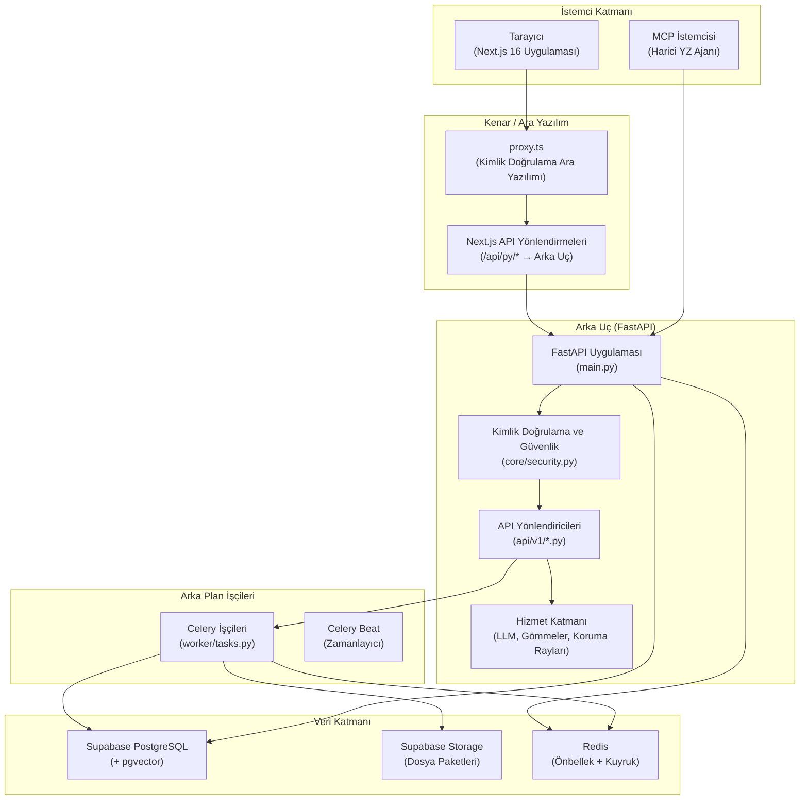
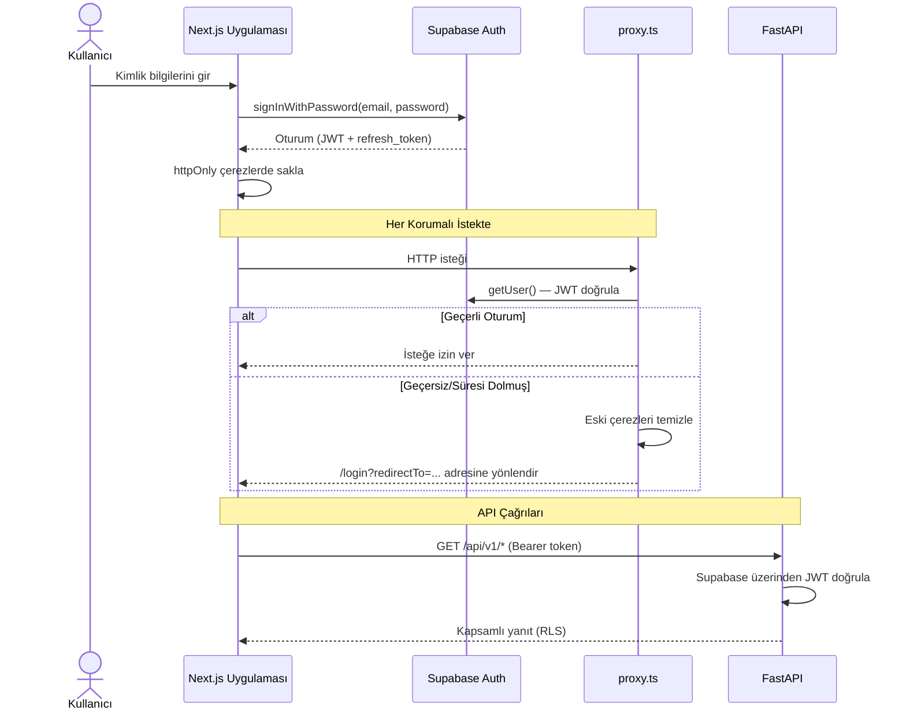
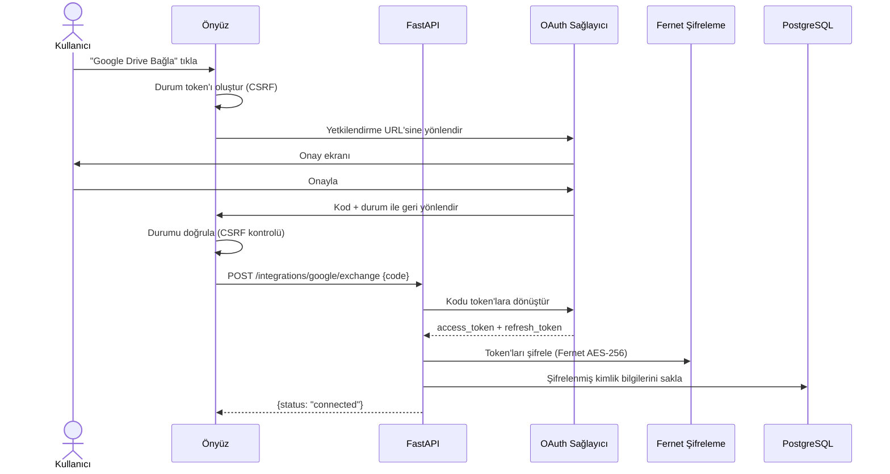
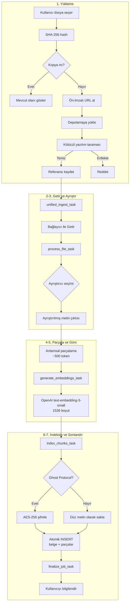
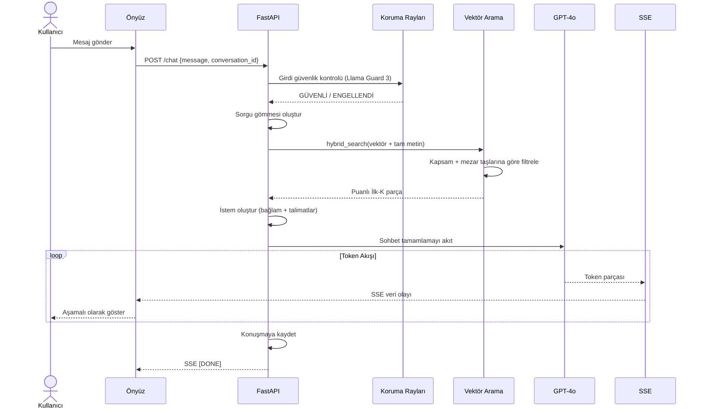
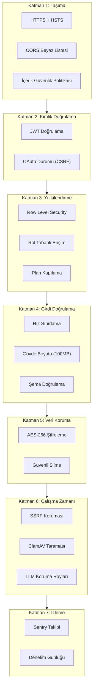
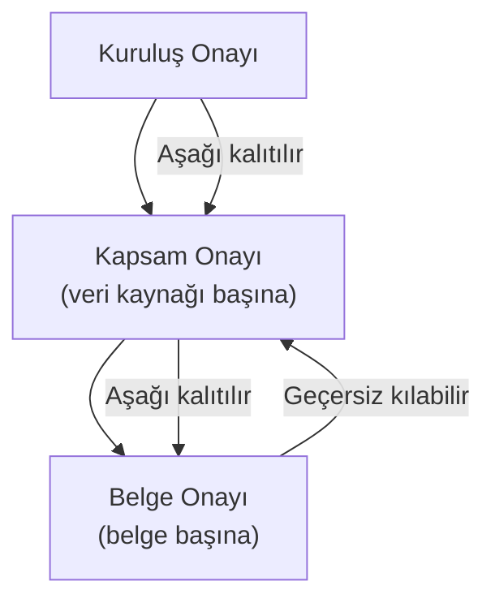
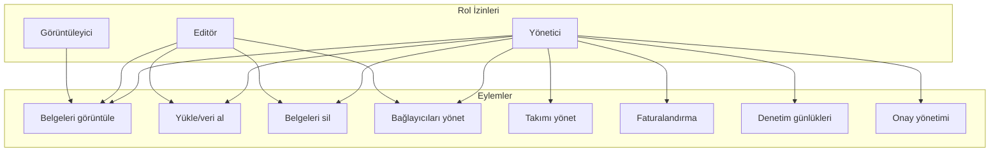
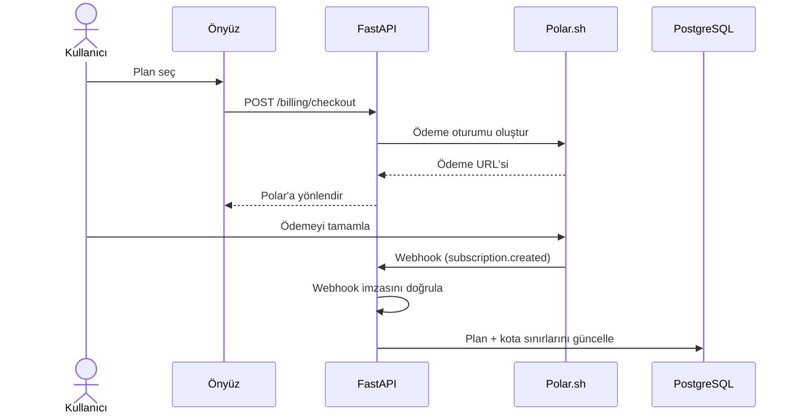
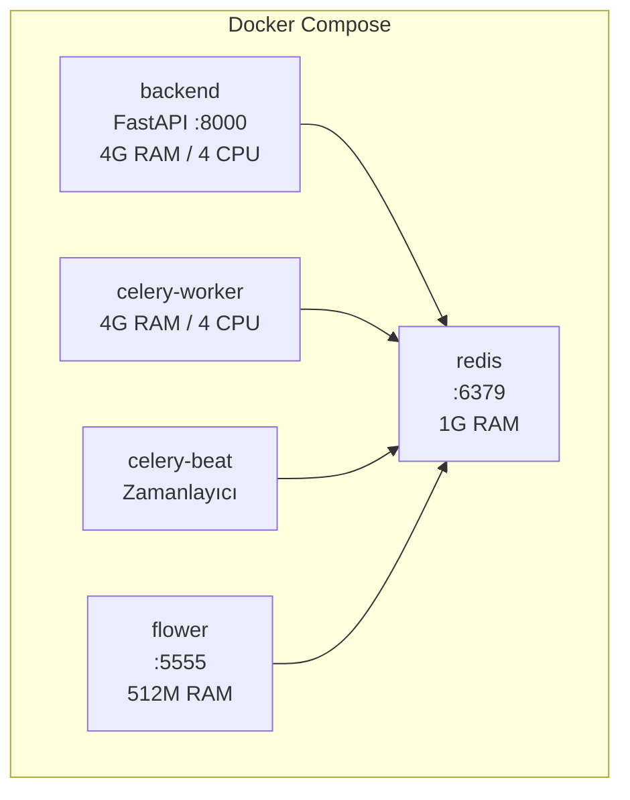

# AxioHub Ürün Dokümantasyonu

> **Sürüm:** 1.0 | **Tarih:** Şubat 2026 | **Durum:** Üretim
>
> AxioHub RAG SaaS platformu için kapsamlı teknik ve ürün dokümantasyonu.
> Bu belge mimari, iş akışları, güvenlik, uyumluluk ve en iyi uygulamaları kapsar.

---

## İçindekiler

1. [Yönetici Özeti](#1-yönetici-özeti)
2. [Sistem Mimarisi Genel Bakış](#2-sistem-mimarisi-genel-bakış)
3. [Kimlik Doğrulama ve Oturum Yönetimi](#3-kimlik-doğrulama-ve-oturum-yönetimi)
4. [Veri Bağlayıcı Sistemi](#4-veri-bağlayıcı-sistemi)
5. [Dosya İşleme Hattı (Veri Alımı)](#5-dosya-işleme-hattı-veri-alımı)
6. [RAG Sohbet Sistemi](#6-rag-sohbet-sistemi)
7. [Güvenlik Mimarisi](#7-güvenlik-mimarisi)
8. [Uyumluluk ve Onay Yönetimi](#8-uyumluluk-ve-onay-yönetimi)
9. [Takım ve Erişim Kontrolü](#9-takım-ve-erişim-kontrolü)
10. [Faturalandırma ve Abonelik](#10-faturalandırma-ve-abonelik)
11. [Önyüz Mimarisi](#11-önyüz-mimarisi)
12. [Altyapı ve Dağıtım](#12-altyapı-ve-dağıtım)
13. [Kurallar ve Kısıtlamalar](#13-kurallar-ve-kısıtlamalar)
14. [Uygulanan En İyi Uygulamalar](#14-uygulanan-en-iyi-uygulamalar)

---

## 1. Yönetici Özeti

### AxioHub Nedir?

AxioHub, kuruluşların veri kaynaklarını bağlamasını, belgeleri akıllı bir veri alım hattı üzerinden işlemesini ve yapay zeka destekli bir sohbet arayüzü aracılığıyla bilgi tabanlarıyla etkileşim kurmasını sağlayan **üretim düzeyinde bir Retrieval-Augmented Generation (RAG) platformudur**.

### Temel Değer Önerileri

- **10+ Veri Bağlayıcı**: Google Drive, Notion, Dropbox, GitHub, OneDrive, SharePoint, Box, SFTP, Amazon S3 ve Web Tarayıcı
- **Akıllı Veri Alımı**: Tekilleştirme, ayrıştırma, anlamsal parçalama, gömme üretimi ve vektör indeksleme içeren otomatik hat
- **Kurumsal Güvenlik**: Durağan AES-256 şifreleme (Ghost Protocol), SSRF koruması, kötücül yazılım taraması, DoD düzeyinde güvenli silme
- **Uyumluluk Desteği**: GDPR Madde 17, CCPA ADMT, KVKK desteği ile uyumluluk mezar taşları aracılığıyla anında erişim iptali
- **Takım İşbirliği**: Plan bazlı özellik kapılaması ile rol tabanlı erişim kontrolü (yönetici/editör/görüntüleyici)
- **Gerçek Zamanlı Güncellemeler**: Anlık bildirimler, iş ilerlemesi ve sekmeler arası senkronizasyon için Supabase Realtime

### Teknoloji Yığını

| Katman | Teknoloji |
|--------|-----------|
| **Önyüz** | Next.js 16.1.5 (App Router), TypeScript, Tailwind CSS, shadcn/ui, React Query |
| **Arka Uç** | FastAPI (Python 3.12+), Celery (dağıtık görev kuyruğu), slowapi (hız sınırlama) |
| **Veritabanı** | Supabase PostgreSQL + pgvector (HNSW indeksleme), Row Level Security |
| **Depolama** | Supabase Storage (ön-imzalı URL'ler ile dosya paketleri) |
| **Yapay Zeka/ML** | OpenAI GPT-4o (sohbet), text-embedding-3-small (1536 boyut), Llama Guard 3 (güvenlik) |
| **Önbellek/Kuyruk** | Redis 7 (önbellekleme, hız sınırlama, Celery broker) |
| **Faturalandırma** | Polar.sh (ödeme işleme, abonelik yönetimi) |
| **İzleme** | Sentry (hata takibi), Celery Flower (görev izleme) |
| **Altyapı** | Docker Compose, GitHub Actions CI/CD |

---

## 2. Sistem Mimarisi Genel Bakış

AxioHub, istemci, kenar ara yazılımı, API arka ucu, arka plan işçileri ve veri depoları arasında net bir ayrım ile **katmanlı bir mimari** izler.



### Bileşen Açıklamaları

| Bileşen | Dosya | Amaç |
|---------|-------|------|
| **proxy.ts** | `frontend-new/proxy.ts` | Kimlik doğrulama oturum doğrulaması, çerez yönetimi ve rota koruması için Next.js 16 ara yazılımı |
| **API Yönlendirmeleri** | `frontend-new/next.config.ts` | `/api/py/*` isteklerini `:8000/api/v1/*` adresindeki FastAPI arka ucuna yönlendirir |
| **FastAPI Uygulaması** | `backend/main.py` | CORS, hız sınırlama ve 16 yönlendirici kaydı ile ana uygulama |
| **Güvenlik Çekirdeği** | `backend/core/security.py` | JWT doğrulama, Fernet şifreleme |
| **API Yönlendiricileri** | `backend/api/v1/*.py` | 100'den fazla uç nokta içeren 18 rota modülü |
| **Celery İşçileri** | `backend/worker/tasks.py` | 6 kuyruk üzerinde 11 görev tanımı |
| **Supabase** | Bulut barındırma | PostgreSQL, Auth, Storage ve Realtime kanalları |
| **Redis** | Docker servisi | Önbellekleme, hız sınırı sayaçları, Celery mesaj aracısı |

---

## 3. Kimlik Doğrulama ve Oturum Yönetimi

### 3.1 Kimlik Doğrulama Akışı

AxioHub, kimlik yönetimi için **Supabase Auth** kullanır ve hem e-posta/şifre hem de OAuth sağlayıcı girişini destekler.



### 3.2 proxy.ts ile Oturum Yönetimi

`proxy.ts` dosyası (`frontend-new/proxy.ts`), Next.js 16 için kimlik doğrulama ara yazılımıdır. Her istekte çalışır ve şunları yönetir:

- **Oturum Doğrulama**: `supabase.auth.getUser()` çağrısı yapar (sunucu taraflı, `getSession()`'dan daha güvenli)
- **Rota Sınıflandırma**: Hariç tutulan yolları (`/_next`, `/api`), genel yolları (`/`, `/login`) ve korumalı yolları ayırt eder
- **Çerez Temizleme**: `session_not_found` veya geçersiz oturumlarda tüm eski kimlik doğrulama çerezlerini temizler
- **Yönlendirme Mantığı**: Kimliği doğrulanmamış kullanıcıları, giriş sonrası navigasyon için `redirectTo` parametresi ile `/login` adresine yönlendirir
- **Kimlik Doğrulama Sayfası Koruması**: Zaten kimliği doğrulanmış kullanıcıları `/login` ve `/register` sayfalarından kontrol paneline yönlendirir

### 3.3 Token Önbellekleme (Önyüz)

Axios istemcisi (`frontend-new/lib/api.ts`), her API çağrısında Supabase'e istek göndermekten kaçınmak için **bellek içi token önbellekleme** uygular:

- **Önbellek Süresi**: Token, 5 dakikalık yenileme tamponuyla bellekte önbelleğe alınır
- **Yenileme Mantığı**: Token 5 dakika içinde sona erecekse, yeni bir oturum getirilir (tekilleştirilmiş)
- **401 İşleme**: 401 yanıtında önbelleğe alınmış token temizlenir ve sonraki istek yeniden kimlik doğrulamayı tetikler
- **Çıkış**: Eski token'ların önlenmesi için çıkışta `clearAuthCache()` çağrılır

### 3.4 OAuth Sağlayıcılar

AxioHub şu sağlayıcılar üzerinden giriş destekler:
- Google (OAuth 2.0)
- GitHub (OAuth 2.0)
- Microsoft (gelişmiş güvenlik için PKCE akışı)

`/auth/callback` adresindeki OAuth geri çağrısı, durum token'ını (CSRF koruması) doğrular ve URL hash'inden oturumu çıkarır.

### 3.5 Açık Yönlendirme Önleme

Kimlik doğrulama geri çağrısı, açık yönlendirme saldırılarını önlemek için `next` parametresini doğrular:
- `/` ile başlamalıdır
- `//` ile başlamamalıdır
- İlk `/` karakterinden önce `:` içermemelidir

---

## 4. Veri Bağlayıcı Sistemi

### 4.1 Bağlayıcı Genel Bakış

AxioHub, her biri `backend/connectors/registry.py` içinde kayıtlı 10 veri bağlayıcıyı destekler:

| Bağlayıcı | Kimlik Doğrulama Türü | Yetenekler | Hız Sınırı (DPM) | Notlar |
|-----------|----------------------|------------|-------------------|--------|
| **Google Drive** | OAuth 2.0 | incremental_sync, binary_content | 600 | Drive API v3 |
| **Notion** | OAuth 2.0 | incremental_sync, html_content | 60 | Blok tabanlı içerik |
| **Dropbox** | OAuth 2.0 | binary_content, incremental_sync, team_spaces | 720 | Takım klasörlerini destekler |
| **GitHub** | OAuth 2.0 | code_aware, incremental_sync, text_content | 80 | Depo seçimi |
| **OneDrive** | OAuth 2.0 (PKCE) | binary_content, incremental_sync | 120 | Microsoft Graph API |
| **SharePoint** | OAuth 2.0 (PKCE) | binary_content, incremental_sync | 120 | Microsoft Graph API |
| **Box** | OAuth 2.0 | binary_content, incremental_sync, enterprise | 600 | İş/Kurumsal |
| **SFTP** | Kimlik Bilgileri (sunucu/kullanıcı/anahtar) | binary_content, incremental_sync | 60 | SSH tabanlı dosya erişimi |
| **Amazon S3** | IAM Kimlik Bilgileri | binary_content, incremental_sync, glacier_aware | 1000 | Yalnızca Kurumsal |
| **Web Tarayıcı** | Yok | crawl, sitemap | 120 | URL tabanlı tarama |

### 4.2 Bağlayıcı Mimarisi

Tüm bağlayıcılar, `BaseConnector`'u genişleten `EnhancedConnector` temel sınıfını (`backend/connectors/enhanced.py`) genişletir:

```
BaseConnector (soyut)
  ├── list_files(config, since) → Iterator[RemoteFile]
  ├── fetch_file_content(file_id, config) → bytes
  ├── validate_config(config) → bool
  └── validate_credentials(credentials) → bool

EnhancedConnector(BaseConnector) (soyut)
  ├── fetch_documents(item_ids, credentials) → AsyncIterator[SourceDocument]
  ├── fetch_documents_sync(item_ids, credentials) → Iterator[SourceDocument]
  └── authorize(user_id) → bool
```

`SourceDocument` veri sınıfı, bağlayıcılar ile veri alım hattı arasındaki standartlaştırılmış sözleşmedir:

| Alan | Tür | Açıklama |
|------|-----|----------|
| `content` | `bytes \| str` | Ham içerik (ikili veya metin) |
| `metadata` | `dict` | Kaynağa özel üst veri |
| `source_type` | `SourceType` | Enum: google_drive, notion, web, vb. |
| `source_id` | `str` | Kaynak sistemdeki benzersiz kimlik |
| `filename` | `str` | Görüntüleme adı |
| `mime_type` | `str` | MIME türü |
| `size_bytes` | `int` | İçerik boyutu |
| `parent_id` | `str \| None` | Üst belge (hiyerarşik kaynaklar) |

### 4.3 OAuth Bağlantı Akışı



### 4.4 Token Şifreleme ve Yenileme

Tüm OAuth token'ları, **Fernet simetrik şifreleme** (HMAC ile AES-256-CBC) kullanılarak durağan olarak şifrelenir:

- **Depolama**: `integrations` tablosunda şifrelenmiş blob olarak saklanır
- **Şifre Çözme**: Bir bağlayıcının sağlayıcıya erişmesi gerektiğinde talep üzerine gerçekleşir
- **Yenileme**: Erişim token'ının süresi dolmuşsa, yenileme token'ı ile yeni bir tane alınır, yeniden şifrelenir ve saklanır
- **Anahtar**: `ENCRYPTION_KEY` ortam değişkeni (Ghost Protocol'ün `CHUNK_ENCRYPTION_KEY`'inden ayrıdır)

### 4.5 Microsoft PKCE Akışı

OneDrive ve SharePoint, gelişmiş OAuth güvenliği için **PKCE (Proof Key for Code Exchange)** kullanır:

1. Önyüz bir `code_verifier` (rastgele 43-128 karakter dizisi) oluşturur
2. `code_challenge` = doğrulayıcının SHA-256 hash'ini hesaplar
3. Yetkilendirme URL'sine `code_challenge` ve `code_challenge_method=S256` ekler
4. Arka uç, yetkilendirme kodunu değiştirirken `code_verifier`'ı gönderir
5. Microsoft, doğrulayıcının orijinal meydan okumayla eşleştiğini doğrular

---

## 5. Dosya İşleme Hattı (Veri Alımı)

### 5.1 Hat Genel Bakış

Veri alım hattı, herhangi bir kaynaktan gelen ham dosyaları aranabilir, vektör indeksli belge parçalarına dönüştürür. 7 aşamadan oluşur:



### 5.2 Ön-imzalı URL Yükleme Akışı

Dosya yüklemeleri, geliştirilmiş performans için arka ucu atlar:

1. **İstemci**: Dosyanın SHA-256 hash'ini hesaplar
2. **İstemci → Arka Uç**: `POST /uploads/check-duplicates` ile `{sha256_hash, filename, size}`
3. **Arka Uç**: Aynı hash'e sahip mevcut belgeleri kontrol eder
4. **İstemci → Arka Uç**: Ön-imzalı URL almak için `POST /uploads/upload-url`
5. **İstemci → Depolama**: Ön-imzalı URL aracılığıyla Supabase Storage'a doğrudan yükleme
6. **İstemci → Arka Uç**: Dosyayı kaydetmek ve veri alımını tetiklemek için `POST /uploads/file/reference`

### 5.3 Ayrıştırıcı Seçimi

Hat, dosya MIME türüne göre bir ayrıştırıcı seçer:

| Dosya Türü | Ayrıştırıcı | Kütüphane |
|-----------|-------------|-----------|
| PDF | PDF Ayrıştırıcı | PyPDF2 + pdfplumber |
| DOCX | DOCX Ayrıştırıcı | python-docx |
| DOC | Eski Word Ayrıştırıcı | antiword yedek |
| XLSX/XLS | Tablo Ayrıştırıcı | pandas + openpyxl |
| PPTX | Sunum Ayrıştırıcı | python-pptx |
| HTML | HTML Ayrıştırıcı | BeautifulSoup4 |
| Markdown | Markdown Ayrıştırıcı | Yerleşik |
| CSV | Tablo Veri Ayrıştırıcı | pandas |
| JSON/XML | Yapılandırılmış Ayrıştırıcı | Yerleşik |
| EML/MSG | E-posta Ayrıştırıcı | email + extract-msg |
| Kod dosyaları | Kod Ayrıştırıcı | Dil duyarlı (Python, JS, vb.) |

### 5.4 Celery Görev Zinciri

Her veri alımı, özel kuyruklar ve zaman aşımları ile bir Celery görev zincirini tetikler:

| Görev | Kuyruk | Yumuşak Sınır | Sert Sınır | Amaç |
|-------|--------|---------------|------------|------|
| `unified_ingest_task` | ingestion | 900s (15dk) | 960s | Tam hattı düzenle |
| `process_file_task` | file_processing | 600s (10dk) | 660s | Tek bir dosyayı getir, ayrıştır ve parçala |
| `generate_embeddings_task` | embeddings | 600s (10dk) | 660s | OpenAI aracılığıyla vektörler oluştur |
| `index_chunks_task` | indexing | 300s (5dk) | 330s | Parçaları PostgreSQL'de sakla |
| `finalize_job_task` | finalization | 120s (2dk) | 150s | İş durumunu güncelle, kullanıcıyı bilgilendir |

**Web Tarama Görevleri:**

| Görev | Kuyruk | Yumuşak Sınır | Sert Sınır | Amaç |
|-------|--------|---------------|------------|------|
| `crawl_discovery_task` | crawl | 1800s (30dk) | 1860s | Site haritası/bağlantılar aracılığıyla sayfaları keşfet |
| `process_page_task` | crawl | 300s (5dk) | 330s | Tek bir web sayfasını işle |
| `finalize_crawl_task` | crawl | 120s (2dk) | 150s | Tarama sonuçlarını sonlandır |

### 5.5 Gömme Üretimi

- **Model**: OpenAI `text-embedding-3-small` (1536 boyut)
- **TPM Düzenlemesi**: OpenAI'ın dakika başına token sınırları dahilinde kalmak için iş parçacığı güvenli hız sınırlayıcı (`threading.Lock()`)
- **Toplu İşleme**: Parçalar, TPM sınırlarına uyarken verimi en üst düzeye çıkarmak için gruplandırılır
- **Yeniden Deneme Mantığı**: Üstel geri çekilme ile Celery'nin yerleşik yeniden deneme özelliği

### 5.6 Vektör İndeksleme

- **İndeks Türü**: pgvector aracılığıyla HNSW (Hierarchical Navigable Small World)
- **Parametreler**: `m=16`, `ef_construction=64` (bellek ve geri çağırma dengesi)
- **Mesafe**: Kosinüs benzerliği (`vector_cosine_ops`)
- **Atomik Veri Alımı**: Belge + parçalar, `ingest_document_with_chunks` RPC fonksiyonu aracılığıyla tek bir işlemde eklenir

---

## 6. RAG Sohbet Sistemi

### 6.1 Sohbet Akışı



### 6.2 Hibrit Arama

Arama, en uygun alaka düzeyi için vektör benzerliğini tam metin aramasıyla birleştirir:

1. **Vektör Arama**: Sorgu gömmesi, kosinüs benzerliği (pgvector) kullanılarak parça gömmeleriyle karşılaştırılır
2. **Tam Metin Arama**: Anahtar kelime eşleştirmesi için PostgreSQL `ts_rank`
3. **Puan Birleştirme**: Her iki yöntemden birleştirilmiş sıralama
4. **Kapsam Filtreleme**: Sonuçlar, kullanıcının kuruluşu ve izin verilen kapsamlarla sınırlıdır
5. **Mezar Taşı Hariç Tutma**: Silinen belgeleri hariç tutmak için uyumluluk mezar taşları kontrol edilir

### 6.3 Kapsam Duyarlı Arama

Arama sonuçları, veri sızıntısını önlemek için kapsamlandırılır:

- **Kuruluş Kapsamı**: Tüm sorgular `organization_id` ile filtrelenir (RLS uygulamalı)
- **Veri Kaynağı Kapsamı**: Kullanıcılar aramayı belirli bağlayıcılara/kaynaklara kısıtlayabilir
- **Belge Onayı**: Yalnızca aktif onaya sahip belgeler dahil edilir
- **Baskınlık Koruması**: Tek bir veri kaynağının sonuçlara hakim olmasını önler

### 6.4 Model Yapılandırması

| Amaç | Model | Notlar |
|------|-------|--------|
| **Sohbet (Birincil)** | GPT-4o | Ana yanıt üretimi, akış |
| **Sohbet (Hızlı)** | GPT-4o-mini | Basit sorgular için düşük gecikme |
| **Gömmeler** | text-embedding-3-small | 1536 boyut, maliyet etkin |
| **Koruma Rayları** | Llama Guard 3 | Girdi/çıktı güvenlik sınıflandırması |

### 6.5 Akışlı SSE

Sohbet uç noktası, gerçek zamanlı token akışı için **Server-Sent Events (SSE)** kullanır:

- **Kalp Atışı**: Bağlantıyı canlı tutmak için her 15 saniyede bir gönderilir
- **Veri Olayları**: Her token parçası `data: {"content": "..."}` olarak gönderilir
- **Tamamlanma Sinyali**: `data: [DONE]` yanıtın sonunu belirtir
- **Hata İşleme**: Hatalar uygun hata kodlarıyla SSE olayları olarak gönderilir

---

## 7. Güvenlik Mimarisi

### 7.1 Güvenlik Katmanları Genel Bakış

AxioHub, **7 katmanlı derinlemesine savunma** uygular:



### 7.2 Ghost Protocol (Durağan Şifreleme)

Ghost Protocol, AxioHub'ın belge parça içeriği için durağan şifreleme sistemidir:

- **Algoritma**: Fernet (HMAC-SHA256 ile AES-256-CBC)
- **Anahtar**: `CHUNK_ENCRYPTION_KEY` ortam değişkeni
- **Kapsam**: `document_chunks.content` içinde saklanan tüm belge parça içeriği
- **Şifreleme**: Veri alımı sırasında uygulanır (`index_chunks_task` içinde)
- **Şifre Çözme**: Arama/sohbet sırasında uygulanır (veritabanından alırken)
- **Katı Mod**: Etkinleştirildiğinde, şifrelenmemiş parça okumalarını reddeder

**Anahtar Yönetimi:**
- Anahtar en az 2 güvenli konumda yedeklenmelidir
- Anahtar kaybolursa, tüm şifrelenmiş veriler **kalıcı olarak kurtarılamaz**
- Anahtar rotasyonu, tümünü çöz + yeniden şifrele geçişi gerektirir

### 7.3 SSRF Koruması

`connectors/web.py` içindeki `_enforce_public_endpoint` fonksiyonu, Sunucu Taraflı İstek Sahteciliğini (SSRF) önler:

1. **DNS Çözümleme**: TÜM DNS kayıtlarını çözümlemek için `getaddrinfo()` kullanır (`gethostbyname()` değil)
2. **IP Doğrulama**: Çözümlenen her IP, `_is_public_ip()` ile kontrol edilir:
   - Özel aralıkları engeller (10.x, 172.16-31.x, 192.168.x)
   - Geri döngüyü engeller (127.x)
   - Bağlantı-yerel adresleri engeller (169.254.x)
   - Ayrılmış, çok noktaya yayın ve belirtilmemiş adresleri engeller
3. **Tüm Kayıtlar Kontrol Edilir**: Bir IP genel olsa bile, çözümlenen herhangi bir IP özel ise istek engellenir

### 7.4 Kötücül Yazılım Taraması

- **Motor**: ClamAV (`clamd` soketi aracılığıyla)
- **Tetikleme**: Tüm dosya yüklemeleri veri alımından önce taranır
- **Kapalı-Başarısızlık**: `MALWARE_SCAN_FAIL_CLOSED=True` (üretim varsayılanı) olduğunda, ClamAV kullanılamıyorsa yüklemeler **reddedilir**
- **Entegrasyon**: Tarama, yükleme ile dosya referans kaydı arasında gerçekleşir

### 7.5 Hız Sınırlama

Hız sınırlama, Redis destekli **slowapi** (limits kütüphanesi üzerine kurulu) aracılığıyla uygulanır:

| Uç Nokta Kategorisi | Sınır | Notlar |
|---------------------|-------|--------|
| Sohbet / Akış | 30/dakika | Kullanıcı başına |
| Belge işlemleri | 60/dakika | CRUD işlemleri |
| Dosya yükleme | 30/dakika | Kopya kontrolü dahil |
| Entegrasyonlar | 30/dakika | OAuth + veri alımı |
| Takım işlemleri | 30/dakika | Davet, rol değişiklikleri |
| Faturalandırma | 10/dakika | Ödeme, portal |
| Yönetici uç noktaları | 30/dakika | Denetim günlükleri, güvenlik |
| Sağlık kontrolleri | 60/dakika | İzleme |
| İş işlemleri | 10-60/dakika | İşleme göre değişir |

### 7.6 Güvenli Dosya Silme (DoD 5220.22-M)

Bir kullanıcı veya uyumluluk talebi belge silmeyi tetiklediğinde:

1. **Geçiş 1**: İçeriği `0x00` (sıfırlar) ile üzerine yaz
2. **Geçiş 2**: İçeriği `0xFF` (birler) ile üzerine yaz
3. **Geçiş 3**: İçeriği rastgele baytlarla üzerine yaz
4. **SİLME**: Satırı veritabanından kaldır
5. **Mezar Taşı**: Anında erişim iptali için `compliance_tombstone` ekle

### 7.7 Önyüz Güvenlik Başlıkları

`frontend-new/next.config.ts` içinde yapılandırılmıştır:

| Başlık | Değer | Amaç |
|--------|-------|------|
| `Strict-Transport-Security` | `max-age=31536000; includeSubDomains; preload` | 1 yıl boyunca HTTPS zorunluluğu |
| `X-Frame-Options` | `DENY` | Tıklama hırsızlığını önle |
| `X-Content-Type-Options` | `nosniff` | MIME koklama önleme |
| `Referrer-Policy` | `strict-origin-when-cross-origin` | Referans bilgisini kontrol et |
| `Permissions-Policy` | `camera=(), microphone=(), geolocation=()` | Tehlikeli API'leri devre dışı bırak |
| `Content-Security-Policy` | Kapsamlı beyaz liste | Betik, stil, bağlantı kaynakları |

### 7.8 Row Level Security (RLS)

Tüm kritik tablolarda Supabase PostgreSQL'de RLS etkinleştirilmiştir:

- **documents**: Kullanıcılar yalnızca kendi kuruluşlarındaki belgelere erişebilir
- **document_chunks**: Üst belgenin kuruluşuna göre kapsamlandırılmış
- **integrations**: Kullanıcıya özel bağlayıcı kimlik bilgileri
- **audit_logs**: Yalnızca servis rolü (arka uç yazar, doğrudan kullanıcı erişimi yok)
- **compliance_tombstones**: Kuruluş kapsamlı, yazma için servis rolü

---

## 8. Uyumluluk ve Onay Yönetimi

### 8.1 Uyumluluk Çerçevesi

AxioHub üç uyumluluk çerçevesini destekler:

| Çerçeve | Kapsam | Temel Haklar |
|---------|--------|-------------|
| **GDPR Madde 17** | AB veri özneleri | Silinme hakkı, veri taşınabilirliği |
| **CCPA ADMT** | Kaliforniya tüketicileri | Bilme, silme, vazgeçme hakkı |
| **KVKK** | Türk veri özneleri | Kişisel veri koruması |

### 8.2 Onay Yönetimi

Onay, kalıtım ile üç seviyede yönetilir:



**API Uç Noktaları:**
- `GET /consent/organization` — Kuruluş düzeyinde onayı al
- `PATCH /consent/organization` — Kuruluş onayını güncelle
- `GET /consent/scope` — Kapsam düzeyinde onayı al
- `PATCH /consent/scope` — Kapsam onayını güncelle
- `POST /consent/scope/bulk` — Kapsamları toplu güncelle
- `GET /consent/document/{id}` — Belge onayını al
- `PATCH /consent/document/{id}` — Belge onayını güncelle
- `PATCH /consent/scope/agents` — Kapsam başına YZ ajan erişimini güncelle
- `PATCH /consent/document/{id}/agents` — Belge başına YZ ajan erişimini güncelle

### 8.3 Uyumluluk Mezar Taşları

Uyumluluk amacıyla veri silindiğinde, anında erişim iptali için bir **mezar taşı** oluşturulur:

1. **Mezar taşı EKLE** → Veri, arama/getirmeden hemen engellenir (10-20ms)
2. **Supabase Realtime** tüm bağlı istemcilere yayın yapar
3. **Ghost Protocol** güvenli silme başlatılır (3 geçişli üzerine yazma)
4. **Mezar taşı durumu** `completed` olarak güncellenir

Mezar taşı şeması şunları destekler:
- Kaynak türleri: `document`, `scope`, `organization`, `user`
- Uyumluluk türleri: `gdpr_art17`, `ccpa_admt`, `kvkk`, `user_request`
- Arama sorgularında hızlı içerme kontrolleri için GIN indeksli diziler

### 8.4 Denetim İzi

Tüm onay değişiklikleri ve uyumluluk eylemleri günlüğe kaydedilir:

- `GET /consent/audit` — Onay değişikliklerinin sayfalı denetim günlüğü
- `GET /consent/report` — Uyumluluk özet raporu
- `GET /audit-logs` — Genel denetim günlükleri (yönetici)
- `GET /security-log` — Güvenlik olayları (giriş, IP değişiklikleri)

---

## 9. Takım ve Erişim Kontrolü

### 9.1 Rol Tabanlı Erişim Kontrolü



### 9.2 Takım Yönetimi

| Eylem | Uç Nokta | Gereken Rol |
|-------|----------|-------------|
| Takım bilgisi al | `GET /team` | Herhangi bir üye |
| Takımı güncelle | `PATCH /team` | Yönetici |
| Takımı sil | `DELETE /team` | Yönetici (sahip) |
| Üyeleri listele | `GET /team/members` | Herhangi bir üye |
| Üye davet et | `POST /team/invite` | Yönetici |
| Toplu davet (CSV) | `POST /team/bulk-invite` | Yönetici |
| Üye ekle | `POST /team/members` | Yönetici |
| Rolü güncelle | `PATCH /team/members/{id}` | Yönetici |
| Üyeyi kaldır | `DELETE /team/members/{id}` | Yönetici |
| Daveti yeniden gönder | `POST /team/members/{id}/resend` | Yönetici |
| Daveti kabul et | `POST /team/accept` | Davetli kullanıcı |
| Davetlerim | `GET /team/my-invites` | Herhangi bir kullanıcı |
| Takım istatistikleri | `GET /team/stats` | Herhangi bir üye |

### 9.3 Davet Akışı

1. Yönetici, e-posta ile kullanıcıyı davet eder (`POST /team/invite`)
2. Sistem, davet bağlantısı (`/invite/{token}`) içeren e-posta gönderir
3. Kullanıcı bağlantıya tıklar ve davet ayrıntılarını görür
4. Kullanıcı daveti kabul eder (`POST /team/accept`)
5. Kullanıcı, atanan rolle eklenir
6. CSV yüklemesi ile toplu davetler desteklenir (`POST /team/bulk-invite`)

### 9.4 Plan Bazlı Özellik Kapılama

Özellikler, `require_plan` bağımlılığı kullanılarak abonelik planına göre kapılanır:

| Özellik | Ücretsiz | Başlangıç | Pro | Kurumsal |
|---------|----------|-----------|-----|----------|
| Belgeler | Sınırlı | Standart | Genişletilmiş | Sınırsız |
| Takım üyeleri | 1 | 3 | 10 | Sınırsız |
| Web tarama | Hayır | Evet | Evet | Evet |
| Premium modeller | Hayır | Hayır | Evet | Evet |
| S3 bağlayıcı | Hayır | Hayır | Hayır | Evet |
| Özel markalama | Hayır | Hayır | Hayır | Evet |

---

## 10. Faturalandırma ve Abonelik

### 10.1 Faturalandırma Akışı



### 10.2 Abonelik Planları

| Özellik | Ücretsiz | Başlangıç | Pro | Kurumsal |
|---------|----------|-----------|-----|----------|
| **Fiyat** | $0 | $19/ay | $49/ay | Özel |
| **Depolama** | 100MB | 1GB | 10GB | Sınırsız |
| **Günlük işler** | 5 | 50 | 200 | Sınırsız |
| **Takım üyeleri** | 1 | 3 | 10 | Sınırsız |
| **Bağlayıcılar** | 2 | 5 | Tümü | Tümü + S3 |
| **Web tarama** | Hayır | Evet | Evet | Evet |
| **Premium modeller** | Hayır | Hayır | Evet | Evet |
| **Öncelikli destek** | Hayır | Hayır | Evet | Evet |

### 10.3 Kota Kontrolü

Kotalar birden fazla noktada kontrol edilir:
- **Yükleme**: Ön-imzalı URL üretiminden önce depolama sınırı kontrol edilir
- **Veri Alımı**: Görev gönderiminden önce günlük iş sayısı kontrol edilir
- **Gömme**: TPM (dakika başına token) plan bazında düzenlenir
- **Takım**: Davetten önce üye sayısı kontrol edilir

Kota aşıldığında, API açıklayıcı bir hata mesajıyla HTTP 402 döndürür ve önyüz bir yükseltme istemi gösterir.

### 10.4 Webhook İşleme

Polar.sh webhook'ları `POST /webhooks/polar` adresinde işlenir:
- **İmza doğrulama**: Her webhook kriptografik olarak doğrulanır
- **Desteklenen olaylar**: `subscription.created`, `subscription.updated`, `subscription.cancelled`, `order.completed`
- **Ölü Mektup Kuyruğu**: Başarısız webhook'lar yeniden deneme için DLQ'da saklanır
- **Eşgüçlülük**: Mükerrer webhook'lar güvenli bir şekilde yoksayılır

---

## 11. Önyüz Mimarisi

### 11.1 Rota Yapısı

Next.js 16 uygulaması, 5 rota grubuna sahip App Router kullanır:

| Grup | Düzen | Sayfalar | Amaç |
|------|-------|---------|------|
| **(auth)** | Kimlik doğrulama düzeni | login, register, forgot-password | Kimlik doğrulama sayfaları |
| **(marketing)** | Pazarlama düzeni | landing, legal/[slug] | Genel sayfalar |
| **auth** | Yok | callback, reset-password, auth-code-error | Kimlik doğrulama işleyicileri |
| **dashboard** | Kontrol paneli düzeni | chat, documents, settings/*, help | Korumalı uygulama |
| **oauth** | Yok | callback | OAuth yönlendirme işleyicisi |

### 11.2 Sağlayıcı Yığını

Kontrol paneli düzeni, tüm korumalı rotaları derinden iç içe geçmiş bir sağlayıcı yığınına sarar:

```
<QueryProvider>                     ← React Query (5dk bayat, 10dk gc)
  <SessionProvider>                 ← Supabase kimlik doğrulama durumu
    <ThemeProvider>                  ← Açık/koyu/sistem teması
      <ProfileProvider>             ← Kullanıcı profili (tek getirme)
        <UsageProvider>             ← Plan + kotalar (tekil)
          <QuotaStatusProvider>     ← Kaynak başına kota (localStorage)
            <DataInvalidationProvider>  ← Ghost Protocol mezar taşları
              <ChatHistoryProvider>     ← Konuşmalar (plan kapılı)
                <IngestModalProvider>   ← Genel yükleme modeli
                  <IngestionProgressProvider>  ← İlerleme takibi
                    <PaywallGuard>      ← Abonelik zorunluluğu
                      {children}
```

### 11.3 Durum Yönetimi

| Kalıp | Araç | Kullanım Alanı |
|-------|------|----------------|
| **Sunucu Durumu** | React Query (TanStack) | API verisi, önbellekleme, tekilleştirme, iyimser güncellemeler |
| **Tekil Durum** | Context Provider'lar | Profil, kullanım, kota (oturum başına tek getirme) |
| **Yerel Kalıcılık** | localStorage | Tema, kota durumu, sekme kimlikleri |
| **Sekmeler Arası Senkronizasyon** | BroadcastChannel | Kullanıcı, profil, takım, bildirimler, kullanım, kota, ayarları senkronize eder |
| **Gerçek Zamanlı** | Supabase Realtime | Mezar taşları, iş durumu, bildirimler |

### 11.4 İstek Tekilleştirme

React Strict Mode ve birden fazla bileşen, mükerrer API çağrılarına neden olabilir. `lib/request-dedup.ts` modülü şunları sağlar:

- `dedupedRequest(key, fetcher)` — Aynı anahtarla 100ms içindeki birden fazla çağrı, tek bir promise'i yeniden kullanır
- `createDedupedQueryFn(queryKey, fetcher)` — React Query sarmalayıcısı
- Profil, Kullanım ve diğer tekil getirmelerde kullanılır

### 11.5 Sekmeler Arası Senkronizasyon

`lib/crossTabSync.ts` modülü BroadcastChannel API'sini kullanır:

- Bir sekme veriyi güncellediğinde, bir geçersizleştirme mesajı yayınlar
- Diğer sekmeler mesajı alır ve React Query önbelleğini geçersiz kılar
- **İzin Listesi**: Yalnızca hafif sorgular senkronize edilir (kullanıcı, profil, takım, bildirimler, kullanım, kota, ayarlar)
- **Hariç Tutulan**: Belgeler, arama, geri bildirim (BroadcastChannel için çok büyük)

### 11.6 Hata Sınırı Stratejisi

18'den fazla hata sınırı dosyası, bölüm başına hata kurtarma sağlar:

| Kapsam | Dosya | Davranış |
|--------|-------|----------|
| **Uygulama geneli** | `global-error.tsx` | Sentry ile tam sayfa hata |
| **Kontrol Paneli** | `dashboard/error.tsx` | Kontrol paneli düzeyinde kurtarma |
| **Sohbet** | `chat/[chatId]/error.tsx` | Sohbet başına hata |
| **Yardım** | `help/[slug]/error.tsx` | Makale başına hata |
| **Yasal** | `legal/[slug]/error.tsx` | Yasal sayfa başına hata |
| **Davet** | `invite/[token]/error.tsx` | Davet başına hata |
| **Ayarlar (12)** | `settings/*/error.tsx` | Ayar bölümü başına kurtarma |

Her hata sınırı:
- React oluşturma hatalarını yakalar
- Bileşen yığını ile Sentry'ye raporlar
- "Yeniden Dene" düğmesi sağlar (sıfırlamayı tetikler)
- Kullanıcı dostu hata mesajı gösterir

### 11.7 Özel Hook'lar

Alana göre düzenlenmiş temel hook'lar:

**Kimlik Doğrulama:** `useAuth`, `useProfile`

**Veri Yönetimi:** `useChatHistory`, `useDocuments`, `useSearch`, `useDocumentCount`, `useDataInvalidation`, `useFileStatus`

**Kullanım ve Kotalar:** `useUsage`, `useQuotaStatus`

**Bildirimler:** `useNotifications`, `useNotificationSettings`

**Veri Alımı:** `useIngestionJobs`, `useIngestionProgress`, `useIngestModal`

**Takım:** `useTeamMembers`, `usePendingInvites`

**Uyumluluk:** `useApprovals`, `useConsent`, `useAuditLogs`, `useSecurityLog`

**Arayüz:** `useTheme`, `useMobile`, `useDirtyForm`, `useOnboarding`, `useNetworkStatus`, `useRealtimeStatus`

---

## 12. Altyapı ve Dağıtım

### 12.1 Docker Mimarisi



### 12.2 Üretim ve Geliştirme Karşılaştırması

| Husus | Geliştirme | Üretim |
|-------|-----------|--------|
| **Portlar** | Tümü açık (8000, 5555, 6379) | Yalnızca backend:8000 |
| **Ağ** | Varsayılan köprü | Dahili izole ağ |
| **Redis** | Geçici | AOF kalıcılığı etkin |
| **Flower** | Kimlik doğrulama yok | Temel kimlik doğrulama gerekli |
| **Günlükler** | Konsol çıktısı | JSON rotasyonu (10MB x 3) |
| **Yeniden Başlatma** | Yeniden başlatma politikası yok | Tümünde `unless-stopped` |
| **Ortam doğrulama** | Atlandı (CI=true) | Derleme zamanında tam doğrulama |

### 12.3 CI/CD İş Hattı

`.github/workflows/ci.yml` içinde 6 paralel iş:

| İş | Araç | Amaç |
|----|------|------|
| **Lint** | ruff | Python lintleme + biçimlendirme |
| **Arka Uç Testi** | pytest | Birim testleri (`-m unit`) |
| **Önyüz Lint** | ESLint + TS | TypeScript + lint kontrolleri |
| **Önyüz Testi** | Vitest | 2.798 önyüz testi |
| **Önyüz Derleme** | Next.js | Derleme doğrulama |
| **Güvenlik Denetimi** | pip-audit + npm audit | Bağımlılık güvenlik açıkları |

### 12.4 Sağlık Kontrolü Uç Noktaları

**Aktif uç nokta** (`main.py` içerisinde doğrudan tanımlı):

| Uç Nokta | Amaç | Yanıt |
|----------|------|-------|
| `GET /health` | DB + Redis bağlantı kontrolü | `{status, version, environment, services, issues}` |

DB sağlıklıysa `200 OK` döner (Redis kapalı = bozulmuş ama yine de `200`). Yalnızca veritabanına erişilemiyorsa `503` döner.

> **Not:** `backend/api/v1/health.py` dosyası ek Kubernetes tarzı yoklamalar tanımlar (`/health/ready`, `/health/live`, `/health/startup`) ancak bu yönlendirici `main.py` içerisinde kayıtlı değildir. Bunlar gelecekteki K8s dağıtımı için hazırlanmıştır.

### 12.5 İzleme

- **Sentry**: İstemci (tarayıcı), sunucu (Next.js API rotaları) ve kenar (ara yazılım) için yapılandırılmıştır
- **Flower**: Celery görev izleme panosu (port 5555)
- **Denetim Günlükleri**: Tüm kritik eylemler `audit_logs` tablosuna kaydedilir
- **Sağlık Kontrolleri**: Arka uçta Docker sağlık kontrolleri (30 saniye aralık), Redis (10 saniye aralık), Flower (30 saniye aralık)

---

## 13. Kurallar ve Kısıtlamalar

### 13.1 Dosya Boyutu Sınırları

| Kısıtlama | Değer |
|-----------|-------|
| Maksimum yükleme boyutu | 100 MB (Content-Length ara yazılımı) |
| Ayrıştırma için maksimum dosya boyutu | Plana bağlı |
| İstek gövdesi sınırı | 100 MB |

### 13.2 Hız Sınırları (kullanıcı başına, dakika başına)

| Kategori | Oran |
|----------|------|
| Sohbet / Akış | 30/dk |
| Belge CRUD | 60/dk |
| Dosya yükleme | 30/dk |
| Entegrasyonlar | 30/dk |
| Takım işlemleri | 30/dk |
| Faturalandırma | 10/dk |
| Yönetici | 30/dk |
| Sağlık | 60/dk |
| İş yeniden deneme | 10-30/dk |

### 13.3 Celery Görev Zaman Aşımları

| Görev | Yumuşak Sınır | Sert Sonlandırma |
|-------|---------------|-----------------|
| unified_ingest_task | 15 dk | 16 dk |
| process_file_task | 10 dk | 11 dk |
| generate_embeddings_task | 10 dk | 11 dk |
| index_chunks_task | 5 dk | 5,5 dk |
| finalize_job_task | 2 dk | 2,5 dk |
| crawl_discovery_task | 30 dk | 31 dk |
| process_page_task | 5 dk | 5,5 dk |
| finalize_crawl_task | 2 dk | 2,5 dk |
| health_check_task | 30 sn | 60 sn |

### 13.4 Bağlayıcı Hız Sınırları (DPM)

| Bağlayıcı | Sınır | Neden |
|-----------|-------|-------|
| Google Drive | 600 | API kotası |
| Notion | 60 | Katı hız sınırları |
| Dropbox | 720 | ~12 çağrı/sn taban |
| GitHub | 80 | 5000/saat kotası |
| OneDrive/SharePoint | 120 | Microsoft Graph sınırları |
| Box | 600 | İş hesabı sınırları |
| SFTP | 60 | Bağlantı tabanlı |
| S3 | 1000 | Kendinden kısıtlama (API sınırı yok) |
| Web | 120 | Nazik tarama |

### 13.5 Yeniden Deneme Sınırları

| İşlem | Maks. Yeniden Deneme | Notlar |
|-------|----------------------|--------|
| Dosya veri alımı | 3 | Dosya başına, `retry_count` ile takip edilir |
| Celery görevleri | 3 | Üstel geri çekilme ile yerleşik |
| Webhook işleme | DLQ ile | Ölü Mektup Kuyruğunda saklanır |

### 13.6 Docker Kaynak Sınırları

| Servis | Bellek | CPU | Günlük Rotasyonu |
|--------|--------|-----|-----------------|
| backend | 4 GB | 4 çekirdek | 10MB x 3 dosya |
| celery-worker | 4 GB | 4 çekirdek | 10MB x 3 dosya |
| redis | 1 GB | 1 çekirdek | 10MB x 3 dosya |
| flower | 512 MB | 0,5 çekirdek | 10MB x 3 dosya |

---

## 14. Uygulanan En İyi Uygulamalar

### 14.1 Güvenlik En İyi Uygulamaları

| Uygulama | Gerçekleştirme |
|----------|---------------|
| **Durağan şifreleme** | Parça içeriği için Fernet AES-256 (Ghost Protocol) |
| **Token şifreleme** | OAuth token'ları ayrı Fernet anahtarıyla şifrelenir |
| **SSRF koruması** | `getaddrinfo()` + kapsamlı IP doğrulama |
| **Kötücül yazılım taraması** | Üretimde kapalı-başarısızlık ile ClamAV |
| **Girdi doğrulama** | `max_length`, `Field()` kısıtlamalı Pydantic modelleri |
| **CSRF koruması** | OAuth durum token'ları, geri çağrıda doğrulanır |
| **Açık yönlendirme önleme** | Yol doğrulama (`//` yok, `/` öncesi `:` yok) |
| **Hız sınırlama** | Redis destekli uç nokta başına slowapi sınırları |
| **Güvenli silme** | DoD 5220.22-M 3 geçişli silme |
| **Konsol kapılama** | Üretimde sıfır korumasız `console.*` çağrısı |

### 14.2 Performans Optimizasyonları

| Optimizasyon | Gerçekleştirme |
|-------------|---------------|
| **Token önbellekleme** | Axios interceptor'ında 5 dakikalık bellek içi JWT önbelleği |
| **İstek tekilleştirme** | Mükerrer API çağrı önleme için 100ms penceresi |
| **Sekmeler arası senkronizasyon** | Hafif sorgu geçersizleştirme için BroadcastChannel |
| **Tembel yükleme** | Modal ve ağır bileşenler için `next/dynamic` |
| **HNSW indeksleme** | O(log n) vektör araması için pgvector HNSW |
| **Atomik veri alımı** | Belge + parçalar için tek işlemli RPC |
| **TPM düzenlemesi** | Gömme üretimi için iş parçacığı güvenli kısıtlama |
| **Ön-imzalı URL'ler** | Doğrudan depolamaya yüklemeler arka ucu atlar |

### 14.3 Hata Yönetimi Kalıpları

| Kalıp | Gerçekleştirme |
|-------|---------------|
| **Hata sınırları** | Bölüm başına kurtarma için 18'den fazla `error.tsx` dosyası |
| **Sentry entegrasyonu** | İstemci, sunucu ve kenar hata takibi |
| **extractErrorMessage()** | Merkezi hata mesajı çıkarma yardımcı aracı |
| **Celery başarısızlık işleyicisi** | Tüm görevlerde `handle_task_failure` geri çağrısı |
| **API hata kodları** | `api_error()` yardımcısı ile yapılandırılmış `ApiErrorCode` enum'u |
| **DLQ** | Başarısız webhook'lar ve görevler için Ölü Mektup Kuyruğu |
| **Devre kesici** | Harici hizmet dayanıklılığı için senkron + asenkron destek |

### 14.4 Kod Kalitesi

| Uygulama | Gerçekleştirme |
|----------|---------------|
| **Konsol kapılama** | `devError()`/`devWarn()` yardımcıları, `DEBUG_MODE` bayrağı |
| **Tür güvenliği** | Tam TypeScript (önyüz), Pydantic modelleri (arka uç) |
| **Girdi doğrulama** | Sınırlandırılmış dize alanları (`max_length`), sınırlandırılmış sayfalama (`ge=1, le=N`) |
| **Çıplak except ortadan kaldırma** | Belirli istisnalara daraltıldı (yalnızca 6 kasıtlı kaldı) |
| **Test kapsamı** | 2.798 önyüz testi (Vitest), arka uç birim testleri (pytest) |
| **CI zorunluluğu** | 6 paralel CI işi (lint, test, derleme, güvenlik) |
| **Ortam doğrulama** | `next.config.ts` içinde derleme zamanı ortam değişkeni doğrulama |

---

## Ek: Temel Dosya Yolları

### Arka Uç
| Dosya | Amaç |
|-------|------|
| `backend/main.py` | Uygulama kurulumu, ara yazılım, yönlendirici kaydı |
| `backend/core/config.py` | Tüm ayarlar ve ortam değişkenleri |
| `backend/core/security.py` | Kimlik doğrulama, JWT, Fernet şifreleme |
| `backend/connectors/web.py` | SSRF koruması (`_enforce_public_endpoint`) |
| `backend/core/celery_app.py` | Celery yapılandırması |
| `backend/connectors/` | 10 bağlayıcı uygulamasının tümü |
| `backend/connectors/registry.py` | Bağlayıcı bildirimi ve yetenekleri |
| `backend/connectors/enhanced.py` | Gelişmiş bağlayıcı temel sınıfı |
| `backend/worker/tasks.py` | Tüm Celery görev tanımları |
| `backend/api/v1/` | Tüm API rota işleyicileri |
| `backend/services/` | LLM, gömmeler, koruma rayları, kötücül yazılım |

### Önyüz
| Dosya | Amaç |
|-------|------|
| `frontend-new/proxy.ts` | Next.js 16 kimlik doğrulama ara yazılımı |
| `frontend-new/next.config.ts` | Güvenlik başlıkları, CSP, yönlendirmeler |
| `frontend-new/lib/api.ts` | Axios istemcisi, token önbellekleme |
| `frontend-new/lib/request-dedup.ts` | İstek tekilleştirme |
| `frontend-new/lib/crossTabSync.ts` | Sekmeler arası senkronizasyon |
| `frontend-new/hooks/` | Tüm özel hook'lar |
| `frontend-new/app/` | Rota yapısı (5 grup) |
| `frontend-new/components/` | Bileşen kütüphanesi |

### Altyapı
| Dosya | Amaç |
|-------|------|
| `docker-compose.yml` | Geliştirme Docker servisleri |
| `docker-compose.prod.yml` | Üretim geçersiz kılmaları |
| `.github/workflows/ci.yml` | CI/CD iş hattı |
| `.env.example` | Ortam değişkeni belgelendirmesi (144 değişken) |
| `supabase/migrations/` | 120'den fazla veritabanı geçişi |
